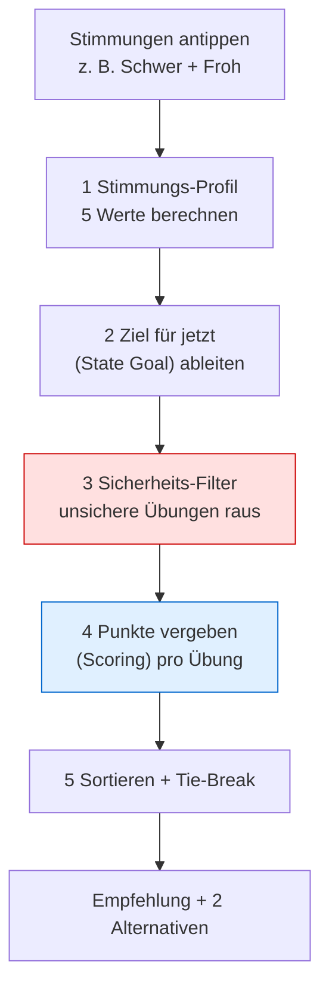
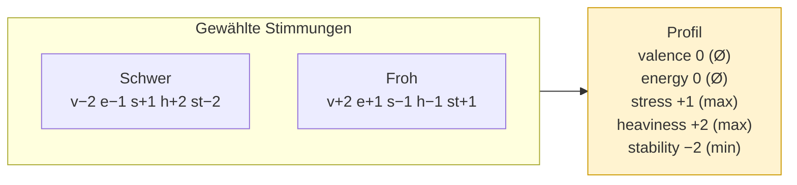
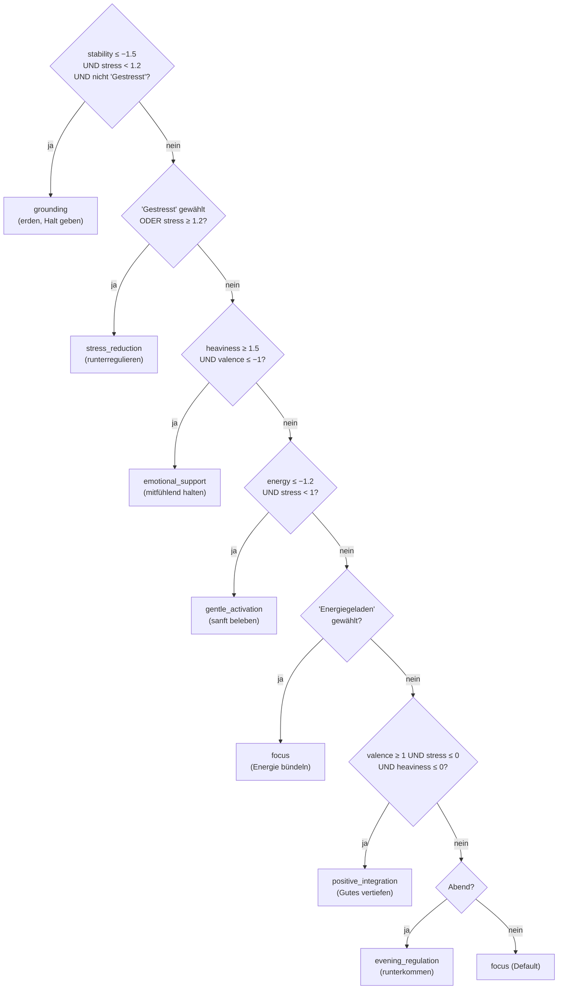
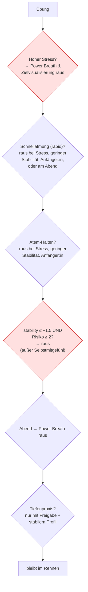
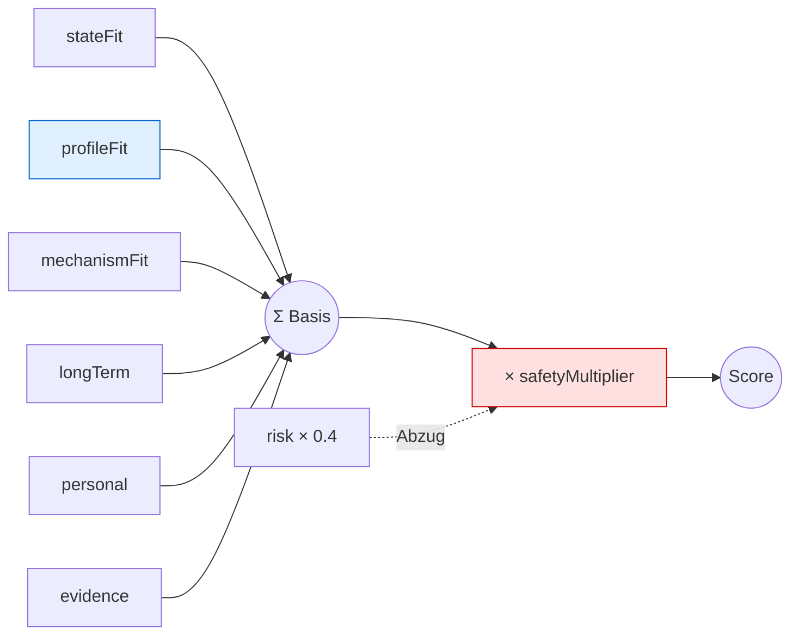
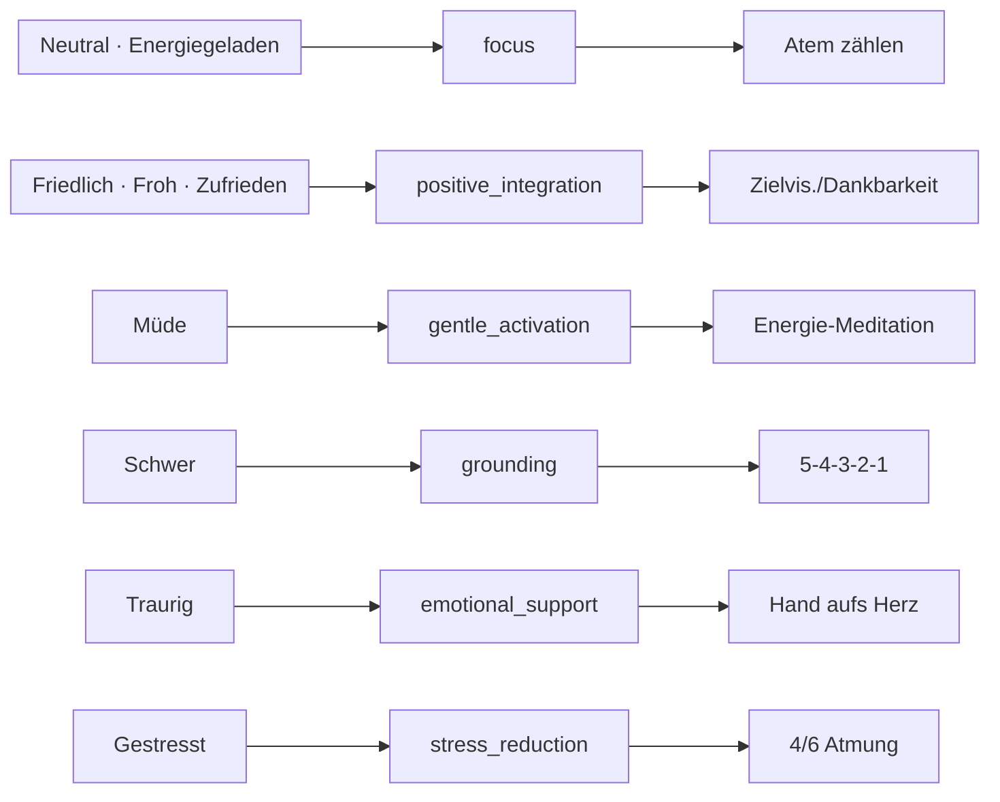

# Wie der Empfehlungs-Algorithmus rechnet

Diese Seite erklärt **für das Team** (ohne Code lesen zu müssen), wie aus den
angetippten Stimmungen eine konkrete Übungs­empfehlung wird. Es gibt bewusst
**leichte Formeln** – damit nachvollziehbar ist, *warum* eine Übung gewinnt.

> Kurz gesagt: Wir bauen aus den Stimmungen ein **Profil** (5 Zahlen), leiten
> daraus ein **Ziel für jetzt** ab, werfen **unsichere Übungen raus** und geben
> dem Rest **Punkte**. Die Übung mit den meisten Punkten wird empfohlen.

---

## 1. Die Gesamt-Pipeline auf einen Blick

Die fünf Schritte laufen **immer in dieser Reihenfolge**. Wichtig: Der
Sicherheits­filter (Schritt 3) ist **unabhängig** vom Ziel – ein sanftes Ziel
kann also nie eine riskante Übung „durchschmuggeln“.

---

## 2. Schritt 1 – Das Stimmungs-Profil (5 Werte)

Jede Stimmung trägt 5 Werte bei, jeweils auf einer Skala von **−2 bis +2**:

| Dimension     | Bedeutung                            |
| ------------- | ------------------------------------ |
| `valence`     | Grundstimmung (negativ ↔ positiv)    |
| `energy`      | Energie / Aktivierung                |
| `stress`      | Anspannung                           |
| `heaviness`   | Schwere / emotionale Last            |
| `stability`   | Gefühl von Halt / Geerdetsein        |

Werden **mehrere** Stimmungen gewählt, fassen wir sie **bewusst unterschiedlich**
zusammen:

$$
\text{valence} = \varnothing \quad
\text{energy} = \varnothing \quad
\text{stress} = \max \quad
\text{heaviness} = \max \quad
\text{stability} = \min
$$

- **Stimmung & Energie** werden **gemittelt** ($\varnothing$) – gegensätzliche
  Stimmungen dürfen sich hier ausgleichen.
- **Stress, Schwere, Stabilität** nehmen den **Worst Case** (Maximum bzw. bei
  Stabilität das Minimum). Das sind die **sicherheits­relevanten** Größen:
  Ein einzelnes stark negatives Signal darf **nicht** von einer ruhigeren
  Stimmung verwässert werden.

> **Warum das wichtig ist:** „Schwer“ + „Froh“ gleichzeitig. Würden wir alles
> mitteln, käme „mittelschwer“ heraus und eine aktivierende Atemübung wäre
> erlaubt. Durch `max`/`min` bleibt das Profil **schwer & wenig stabil** – der
> Sicherheits­filter greift korrekt.

---

## 3. Schritt 2 – Das Ziel für jetzt (State Goal)

Aus dem Profil leiten wir **ein** kurzfristiges Ziel ab. Das ist eine
**Triage** – wie in der Notaufnahme prüfen wir von „spezifischster emotionaler
Bedarf“ nach „allgemein“. **Die erste zutreffende Regel gewinnt.**

> Die Reihenfolge ist Absicht und **sicherheitsorientiert**: Wer wenig Halt hat
> (sehr niedrige Stabilität) **und** nicht akut gestresst ist, wird **zuerst
> geerdet**, bevor emotional tiefer gearbeitet wird. Akuter Stress geht direkt in
> die Beruhigung (ein „aufgedrehter“ Zustand passt besser zu Down-Regulation als
> zu Erdung).

---

## 4. Schritt 3 – Der Sicherheits-Filter (harte Ausschlüsse)

Bevor irgendwer Punkte bekommt, fliegen **unsichere** Übungen komplett raus.
Diese Regeln sind **absolut** – kein Score kann sie überstimmen.

Jede Übung trägt dafür zwei „Sicherheits-Etiketten“:

- `breathTechnique`: `null`, `rapid_breathing` (Schnellatmung) oder
  `breath_hold` (Atem halten).
- `contraindicationRisk`: 0 (unbedenklich) bis 3 (mit Vorsicht).

**Selbstmitgefühl** ist bewusst von zwei Regeln ausgenommen, damit emotionale
Verarbeitung auch bei geringer Stabilität verfügbar bleibt.

---

## 5. Schritt 4 – Das Scoring (Punkte pro Übung)

Jede übrig gebliebene Übung bekommt eine Punktzahl aus mehreren **Bausteinen**:

| Baustein            | Was es misst                                              | Wertebereich |
| ------------------- | --------------------------------------------------------- | ------------ |
| `stateFit`          | Passt die Übung zur **Kategorie** (Ziel für jetzt)?       | −2, +1, +5   |
| `profileFit`        | Bringt sie das Profil **näher an einen Ziel-Zustand**?    | −4 … +6      |
| `mechanismFit`      | Passt das **Wirkprinzip** der Übung zum Ziel?             | 0 … +4       |
| `longTermGoalFit`   | Passt sie zu den **Langzeitzielen** der Person?           | 0 … +4       |
| `personalEvidence`  | Wie hat die Person **ähnliche Übungen** bewertet?         | −2 … +2      |
| `evidenceFit`       | **Plausibilität** aus dem Evidenz-Profil (5 Facetten)     | 0 … 3        |
| `safetyMultiplier`  | **Weiche** Sicherheits-Dämpfung (Faktor)                  | 0 … 1        |
| `riskPenalty`       | **Abzug** für Risiko (`contraindicationRisk`)             | 0 … 3        |

> **Idee dahinter.** `stateFit` hält die Empfehlung in der richtigen Kategorie.
> `profileFit` differenziert **innerhalb** der Kategorie danach, wie gut eine
> Übung den *konkreten* Zustand Richtung Balance bewegt – deshalb führen
> unterschiedliche Stimmungs-Kombis zu unterschiedlichen Übungen. `mechanismFit`
> und `evidenceFit` halten die Auswahl an plausible Wirkprinzipien gekoppelt,
> ohne Übungen fest an Ziele zu verdrahten.

### 5a. State Fit – abgestuft statt schwarz/weiß

$$
\text{stateFit} =
\begin{cases}
+5 & \text{Ziel ist direkt eine der Übungs-Stärken}\\
+1 & \text{Ziel ist *benachbart* (verwandt)}\\
-2 & \text{kein Bezug}
\end{cases}
$$

Beispiel benachbart: Eine `grounding`-Übung ist auch ein **Teil**-Treffer für
`stress_reduction` und `evening_regulation` (verwandte Beruhigungs­ziele).

### 5b. Profile Fit – „bringt die Übung mich näher an Balance?“

Jede Übung trägt einen **Wirkungs-Vektor** `targets` (wie sie die 5 Dimensionen
verschiebt). Statt eines Skalarprodukts vergleicht der `profileFit` jetzt
**Abstände**: Zum Zustandsziel gehört ein **Ziel-Profil** $Z$ (Stress/Schwere
auf 0, Stabilität leicht positiv, Stimmung mindestens neutral, Energie je nach
Ziel). Wir simulieren das Profil **nach** der Übung
($\text{nachher} = \text{Profil} + \text{targets}$) und messen, ob der
**gewichtete Abstand** zu $Z$ kleiner wird:

$$
\text{profileFit} = \operatorname{clamp}\big(\, d_w(\text{Profil}, Z) - d_w(\text{nachher}, Z),\ -4,\ +6\big)
$$

mit gewichtetem Manhattan-Abstand
$d_w(a,b) = \sum_d w_d\,|a_d - b_d|$ und Gewichten
$w_\text{stress}=1{,}4,\ w_\text{stability}=1{,}3,\ w_\text{heaviness}=1{,}2,\ w_\text{energy}=1{,}0,\ w_\text{valence}=0{,}8$.

> Positiv = die Übung **verkleinert** den Abstand zur Balance; negativ = sie
> würde den Zustand eher verstärken (z. B. eine aktivierende Übung für ein schon
> aufgedrehtes Profil).

### 5c. Mechanism Fit & Evidence Fit

Jedes Zustandsziel hat **bevorzugte Wirkprinzipien** (z. B. `stress_reduction` →
beruhigender Atemrhythmus, Aufmerksamkeit verankern). Pro Treffer +2, gedeckelt
bei +4. Der `evidenceFit` fasst fünf Evidenz-Facetten zusammen (Studienlage,
Mechanismus-Plausibilität, Zielgruppen-Passung, App-Tauglichkeit,
Sicherheits-Zuversicht, je 0–3) — bewusst als **Leitplanke**, nicht als Beweis:

$$
\text{evidenceFit} = 0{,}3\,e_\text{Studien} + 0{,}25\,e_\text{Mechanismus} + 0{,}15\,e_\text{Zielgruppe} + 0{,}15\,e_\text{App} + 0{,}15\,e_\text{Sicherheit}
$$

### 5d. Persönliche Evidenz (Bayesianisch geglättet)

Statt einer harten Mindestzahl an Einträgen wird zu einem **neutralen Prior**
hin geglättet. Jede Rückmeldung hat einen beobachteten Effekt
($0{,}5\,(\text{Rating}-3) + 0{,}5\,\text{abgeschlossen} - 0{,}7\,\text{abgebrochen} - 1{,}5\,\text{schlechter}$)
und ein Relevanz-Gewicht (gleiche Übung 1,0; gleiche Familie 0,5; gleiches Ziel
0,3):

$$
\text{personalEvidence} = \operatorname{clamp}\!\left(\frac{0\cdot 5 + \sum_i w_i\,\text{effekt}_i}{5 + \sum_i w_i},\ -2,\ +2\right)
$$

> Ohne Daten bleibt der Wert neutral; wenige Rückmeldungen verschieben ihn nur
> leicht, viele stärker. Bewertungen übertragen **teilweise** auf verwandte
> Übungen.

### 5e. Die Gesamtformel – zwei Gewichtungs-Modi

$$
\textbf{akut} \;\Longleftrightarrow\; \text{stress} \ge 1.2 \;\;\text{oder}\;\; \text{stability} \le -1.5
$$

Zuerst ein **Basis-Score** (gewichtete Summe), dann der weiche Sicherheits-Faktor
und der moderate Risiko-Abzug:

$$
\text{Score} = \text{Basis} \cdot \text{safetyMultiplier} - 0{,}4\,\text{riskPenalty}
$$

**Akut** (Passung zum Jetzt-Zustand zählt am meisten):

$$
\text{Basis}_{akut} = 0{,}9\,\text{stateFit} + 1{,}0\,\text{profileFit} + 0{,}6\,\text{mechanismFit} + 0{,}1\,\text{longTerm} + 0{,}4\,\text{personal} + 0{,}4\,\text{evidence}
$$

**Ruhig** (mehr Raum für Langzeitziele & Vorlieben):

$$
\text{Basis}_{ruhig} = 0{,}7\,\text{stateFit} + 0{,}7\,\text{profileFit} + 0{,}5\,\text{mechanismFit} + 0{,}4\,\text{longTerm} + 0{,}5\,\text{personal} + 0{,}4\,\text{evidence}
$$

> Sicherheit wirkt **zweistufig**: der harte Filter (Schritt 3) schließt ganz
> aus, der `safetyMultiplier` dämpft erlaubte, aber für den Zustand fordernde
> Übungen – ohne Risiko doppelt zu bestrafen.

---

## 6. Schritt 5 – Sortieren & Tie-Break

Sortiert wird nach **Score absteigend**. Bei Gleichstand entscheidet eine
**feste** Reihenfolge (damit das Ergebnis reproduzierbar ist):

1. höherer `evidenceFit` (plausibler gestützt)
2. kürzere Dauer (`durationMinutes`)
3. alphabetisch nach `id`

Die **beste geeignete** Übung wird die Hauptempfehlung. Als **Alternativen**
erscheinen nur Übungen mit **Score > 0**. Zusätzlich merkt sich das Ergebnis, ob
eine Alternative **ähnlich gut** passt (`hasCloseAlternative`, Score-Abstand
< 0,3) – das wird im UI als „mehrere Übungen passen ähnlich gut“ angezeigt.

---

## 7. Komplettes Rechenbeispiel: „Schwer“ + „Froh“

**Schritt 1 – Profil:**
`valence 0, energy 0, stress +1, heaviness +2, stability −2`

**Schritt 2 – Ziel:**
Regel 1 (grounding) prüft `stability ≤ −1.5 (−2 ✓) UND stress < 1.2 (1 ✓) UND
nicht 'Gestresst' (✓)` → trifft zu → **`grounding`**.

**Schritt 3 – Sicherheit:**
`stability −2` ist sehr niedrig. **Power Breath** (Schnellatmung, Risiko 3) →
**raus**. So verhindert das Worst-Case-Pooling genau den gefährlichen Fall.

**Schritt 4 – Scoring** (akut, weil `stability ≤ −1.5`): Übungen, die den Abstand
zum Ziel-Profil (Stress 0, Schwere 0, Stabilität +1) am stärksten verkleinern und
deren Wirkprinzip zu `grounding` passt (Erden über Sinne/Körper, Aufmerksamkeit
verankern), gewinnen.

→ **Empfehlung: 5-4-3-2-1.** Ihr Wirkungs-Vektor (`stress −2`, `heaviness −1`,
`stability +2`) bringt das Profil am deutlichsten Richtung Balance, und ihr
Wirkprinzip (sensorisches Erden) passt direkt zum Ziel.

---

## 8. Übungs-Katalog (16 Übungen)

Maßgeblich ist immer der Code ([`src/data/exercises.ts`](../src/data/exercises.ts));
die vollständige, gepflegte Übersicht steht außerdem im **Hintergrund-Tab** der
App. Jede Übung trägt jetzt statt einer einzelnen `sciencePrior`-Zahl ein
**Evidenz-Profil** (5 Facetten), eine **Übungsfamilie** (`family`), explizite
**Wirkprinzipien** (`mechanisms`) sowie `intensity` und `emotionalDepth` für die
Sicherheits-Dämpfung.

Zu den 12 bestehenden Übungen kamen **vier niedrigschwellige** dazu, die Lücken
bei `focus`, `emotional_support` und `grounding` schließen:

| Übung                       | Familie          | Ziele                                   | Kat.     |
| --------------------------- | ---------------- | --------------------------------------- | -------- |
| Atem zählen                 | attention_focus  | focus, evening_regulation               | basic    |
| Hand aufs Herz              | self_compassion  | emotional_support, grounding            | basic    |
| Erdungsatmung               | slow_breathing   | grounding, stress_reduction, evening    | basic    |
| Emotion im Körper lokalisieren | body_scan     | emotional_support                       | moderate |

Die Spalte **Kat.** ist die `depthCategory` (`basic` / `moderate` / `deep`).

---

## 9. Brauchen wir mehr Übungen? – Abdeckungs-Check

Pro Ziel sollte es **mindestens 2** sichere (Risiko 0–1, Kategorie basic/
moderate) Optionen geben, damit es immer eine echte Wahl und eine Alternative
gibt.

| State Goal              | Sichere Optionen | Status |
| ----------------------- | ---------------- | ------ |
| stress_reduction        | 5-4-3-2-1, Physiological Sigh, 4/6, Erdungsatmung, Box Breathing | gut |
| grounding               | 5-4-3-2-1, 4/6, Erdungsatmung, Hand aufs Herz, Energie-Meditation | gut |
| emotional_support       | Hand aufs Herz, Body Scan, Dankbarkeit, Emotion lokalisieren | gut |
| gentle_activation       | Aktivierende Atmung, Energie-Meditation | gut |
| focus                   | Atem zählen, Box Breathing, Aktivierende Atmung, Zielvisualisierung | gut |
| positive_integration    | Kohärentes Atmen, Dankbarkeit, Zielvisualisierung | gut |
| evening_regulation      | 4/6, Erdungsatmung, Atem zählen, Kohärentes Atmen, Body Scan | gut |

**Empfehlung fürs Team:** Mit den vier neuen Übungen sind die Lücken
geschlossen — jedes Ziel hat mehrere niedrigschwellige, sichere Optionen. Akut
nötig ist nichts mehr; weitere Übungen erhöhen vor allem die Vielfalt.

---

## 10. Alle Stimmungs-Kombinationen → Übung

Die folgenden Tabellen sind **direkt aus dem Algorithmus generiert** (echte
Beginner-Einstellungen: keine Atem-/Meditationserfahrung, keine Tiefenpraxis,
Tageszeit „mittags“). Sie zeigen exakt, was die App ausgibt.

### 10a. Einzelne Stimmung

| Stimmung | State Goal | Primär-Empfehlung | Alternativen |
| --- | --- | --- | --- |
| Friedlich | positive_integration | Zielvisualisierung | Dankbarkeits-Reflexion, Kohärentes Atmen |
| Froh | positive_integration | Dankbarkeits-Reflexion | Zielvisualisierung, Kohärentes Atmen |
| Zufrieden | positive_integration | Zielvisualisierung | Dankbarkeits-Reflexion, Kohärentes Atmen |
| Energiegeladen | focus | Atem zählen | Aktivierende Atmung, Zielvisualisierung |
| Neutral | focus | Atem zählen | Aktivierende Atmung, Zielvisualisierung |
| Müde | gentle_activation | Energie-Meditation | Aktivierende Atmung, Atem zählen |
| Schwer | grounding | 5-4-3-2-1 | Hand aufs Herz, Energie-Meditation |
| Traurig | emotional_support | Hand aufs Herz | Dankbarkeits-Reflexion, Selbstmitgefühl |
| Gestresst | stress_reduction | 4/6 Atmung | Erdungsatmung, 5-4-3-2-1 |

### 10b. Zwei Stimmungen → State Goal

Reihenfolge egal (die Matrix ist symmetrisch). Kürzel: **PI** =
positive_integration, **F** = focus, **G** = grounding, **ES** =
emotional_support, **SR** = stress_reduction.

|              | Friedl. | Froh | Zufr. | Energ. | Neutr. | Müde | Schwer | Traurig | Gestr. |
| ------------ | :-----: | :--: | :---: | :----: | :----: | :--: | :----: | :-----: | :----: |
| **Friedl.**  |   ·     | PI   | PI    | F      | PI     | F    | G      | F       | SR     |
| **Froh**     | PI      | ·    | PI    | F      | PI     | F    | G      | F       | SR     |
| **Zufr.**    | PI      | PI   | ·     | F      | PI     | F    | G      | F       | SR     |
| **Energ.**   | F       | F    | F     | ·      | F      | F    | G      | F       | SR     |
| **Neutr.**   | PI      | PI   | PI    | F      | ·      | F    | G      | ES      | SR     |
| **Müde**     | F       | F    | F     | F      | F      | ·    | G      | ES      | SR     |
| **Schwer**   | G       | G    | G     | G      | G      | G    | ·      | G       | SR     |
| **Traurig**  | F       | F    | F     | F      | ES     | ES   | G      | ·       | SR     |
| **Gestr.**   | SR      | SR   | SR    | SR     | SR     | SR   | SR     | SR      | ·      |

### 10c. Zwei Stimmungen → Primär-Übung

Kürzel: **AZ** = Atem zählen, **DR** = Dankbarkeits-Reflexion,
**AA** = Aktivierende Atmung, **54** = 5-4-3-2-1, **ZV** = Zielvisualisierung,
**HH** = Hand aufs Herz, **EM** = Energie-Meditation, **EA** = Erdungsatmung,
**46** = 4/6 Atmung.

|              | Friedl. | Froh | Zufr. | Energ. | Neutr. | Müde | Schwer | Traurig | Gestr. |
| ------------ | :-----: | :--: | :---: | :----: | :----: | :--: | :----: | :-----: | :----: |
| **Friedl.**  |   ·     | DR   | ZV    | AZ     | DR     | AA   | 54     | AZ      | EA     |
| **Froh**     | DR      | ·    | DR    | AZ     | DR     | AZ   | 54     | AZ      | 46     |
| **Zufr.**    | ZV      | DR   | ·     | AZ     | DR     | AA   | 54     | AZ      | EA     |
| **Energ.**   | AZ      | AZ   | AZ    | ·      | AZ     | AZ   | 54     | AZ      | 46     |
| **Neutr.**   | DR      | DR   | DR    | AZ     | ·      | AA   | 54     | HH      | EA     |
| **Müde**     | AA      | AZ   | AA    | AZ     | AA     | ·    | 54     | HH      | 54     |
| **Schwer**   | 54      | 54   | 54    | 54     | 54     | 54   | ·      | 54      | 54     |
| **Traurig**  | AZ      | AZ   | AZ    | AZ     | HH     | HH   | 54     | ·       | 54     |
| **Gestr.**   | EA      | 46   | EA    | 46     | EA     | 54   | 54     | 54      | ·      |

> **So liest man die Matrix:** Zeile + Spalte = die beiden getippten
> Stimmungen. Beispiel „Schwer“ × „Froh“ → State Goal **G** (grounding) →
> Primär-Übung **54** (5-4-3-2-1) – genau das Rechenbeispiel aus Abschnitt 7.

**Warum manche Felder dieselbe Übung zeigen, ist kein Fehler.** Wo der Zustand
eindeutig ist, ist auch die beste Übung eindeutig (z. B. sehr niedrige
Stabilität → Erden mit 5-4-3-2-1). Differenziert wird dort, wo das Profil
gemischt ist. Insgesamt verteilen sich die Paare auf **neun** verschiedene
Primär-Übungen.

### 10d. Drei Stimmungen

Tripel folgen exakt derselben Mechanik (Profil → Triage → Scoring) – es gibt
**keine** Sonderfälle für größere Auswahlen, nur mehr Eingangssignale. Sobald
**Gestresst** dabei ist, dominiert die Stressregulation; bei sehr niedriger
Stabilität ohne akuten Stress die Erdung; bei Schwere + gedrückter Stimmung die
emotionale Unterstützung. Die exakten Ausgaben lassen sich jederzeit über die
Domain-Funktion `recommendExercises` reproduzieren (sie ist die einzige
Quelle der Wahrheit) bzw. live im **Recommender-Tab** prüfen.

