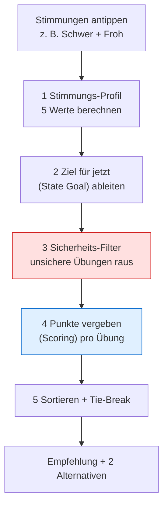
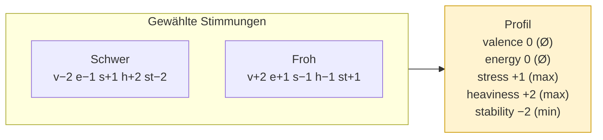
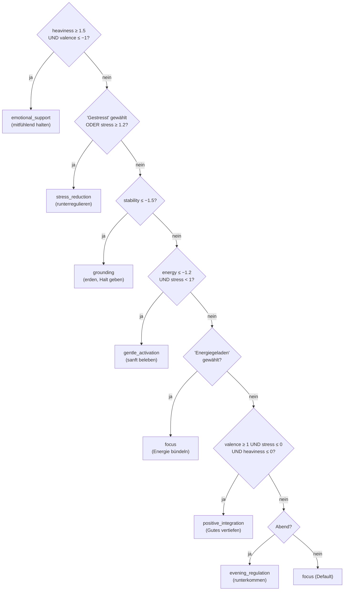
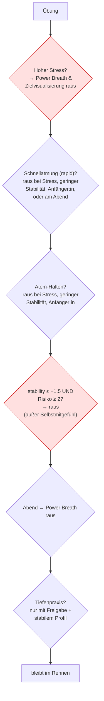
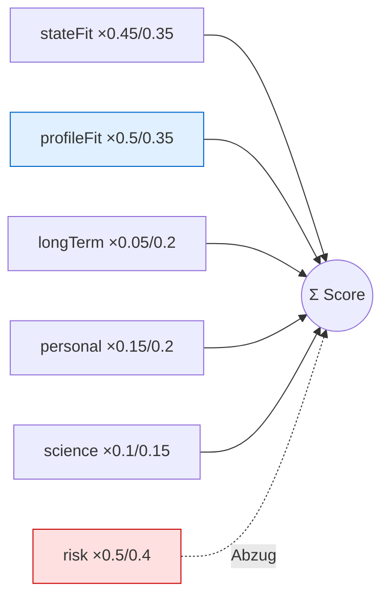
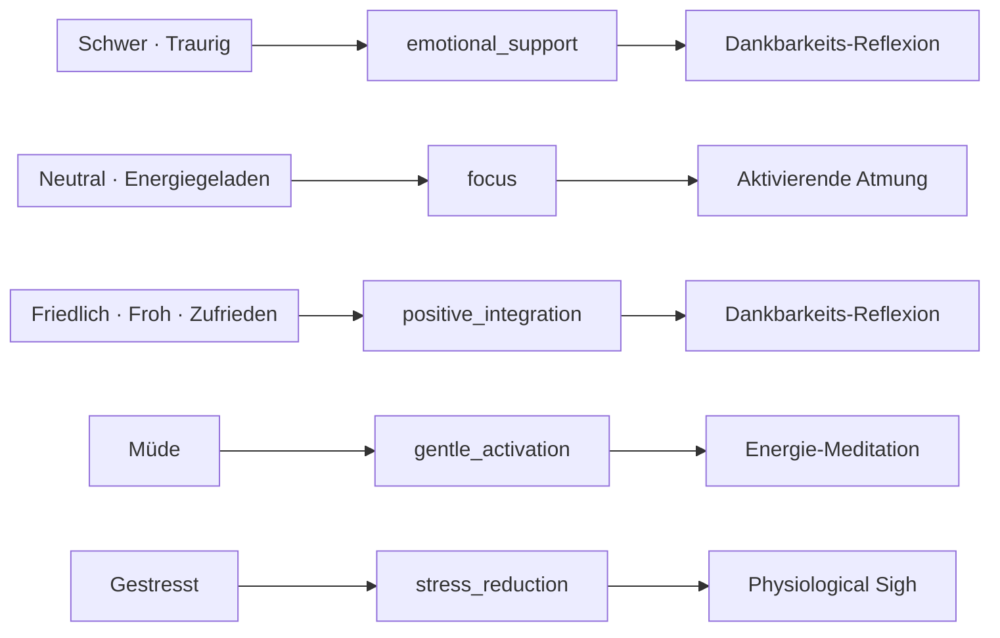

# Wie der Empfehlungs-Algorithmus rechnet

Diese Seite erklärt **für das Team** (ohne Code lesen zu müssen), wie aus den
angetippten Stimmungen eine konkrete Übungs­empfehlung wird. Es gibt bewusst
**leichte Formeln** – damit nachvollziehbar ist, *warum* eine Übung gewinnt.

> Kurz gesagt: Wir bauen aus den Stimmungen ein **Profil** (5 Zahlen), leiten
> daraus ein **Ziel für jetzt** ab, werfen **unsichere Übungen raus** und geben
> dem Rest **Punkte**. Die Übung mit den meisten Punkten wird empfohlen.

---

## 1. Die Gesamt-Pipeline auf einen Blick

Die fünf Schritte laufen **immer in dieser Reihenfolge**. Wichtig: Der
Sicherheits­filter (Schritt 3) ist **unabhängig** vom Ziel – ein sanftes Ziel
kann also nie eine riskante Übung „durchschmuggeln“.

---

## 2. Schritt 1 – Das Stimmungs-Profil (5 Werte)

Jede Stimmung trägt 5 Werte bei, jeweils auf einer Skala von **−2 bis +2**:

| Dimension     | Bedeutung                            |
| ------------- | ------------------------------------ |
| `valence`     | Grundstimmung (negativ ↔ positiv)    |
| `energy`      | Energie / Aktivierung                |
| `stress`      | Anspannung                           |
| `heaviness`   | Schwere / emotionale Last            |
| `stability`   | Gefühl von Halt / Geerdetsein        |

Werden **mehrere** Stimmungen gewählt, fassen wir sie **bewusst unterschiedlich**
zusammen:

$$
\text{valence} = \varnothing \quad
\text{energy} = \varnothing \quad
\text{stress} = \max \quad
\text{heaviness} = \max \quad
\text{stability} = \min
$$

- **Stimmung & Energie** werden **gemittelt** ($\varnothing$) – gegensätzliche
  Stimmungen dürfen sich hier ausgleichen.
- **Stress, Schwere, Stabilität** nehmen den **Worst Case** (Maximum bzw. bei
  Stabilität das Minimum). Das sind die **sicherheits­relevanten** Größen:
  Ein einzelnes stark negatives Signal darf **nicht** von einer ruhigeren
  Stimmung verwässert werden.

> **Warum das wichtig ist:** „Schwer“ + „Froh“ gleichzeitig. Würden wir alles
> mitteln, käme „mittelschwer“ heraus und eine aktivierende Atemübung wäre
> erlaubt. Durch `max`/`min` bleibt das Profil **schwer & wenig stabil** – der
> Sicherheits­filter greift korrekt.

---

## 3. Schritt 2 – Das Ziel für jetzt (State Goal)

Aus dem Profil leiten wir **ein** kurzfristiges Ziel ab. Das ist eine
**Triage** – wie in der Notaufnahme prüfen wir von „spezifischster emotionaler
Bedarf“ nach „allgemein“. **Die erste zutreffende Regel gewinnt.**

> Die Reihenfolge ist Absicht: Emotionaler Bedarf (Schwere/Traurigkeit) kommt
> **vor** Stressregulation, damit jemand in akuter Schwere nicht nur eine
> Atemtechnik, sondern eine **stützende** Übung bekommt.

---

## 4. Schritt 3 – Der Sicherheits-Filter (harte Ausschlüsse)

Bevor irgendwer Punkte bekommt, fliegen **unsichere** Übungen komplett raus.
Diese Regeln sind **absolut** – kein Score kann sie überstimmen.

Jede Übung trägt dafür zwei „Sicherheits-Etiketten“:

- `breathTechnique`: `null`, `rapid_breathing` (Schnellatmung) oder
  `breath_hold` (Atem halten).
- `contraindicationRisk`: 0 (unbedenklich) bis 3 (mit Vorsicht).

**Selbstmitgefühl** ist bewusst von zwei Regeln ausgenommen, damit emotionale
Verarbeitung auch bei geringer Stabilität verfügbar bleibt.

---

## 5. Schritt 4 – Das Scoring (Punkte pro Übung)

Jede übrig gebliebene Übung bekommt eine Punktzahl aus **sechs Bausteinen**:

| Baustein            | Was es misst                                        | Wertebereich |
| ------------------- | --------------------------------------------------- | ------------ |
| `stateFit`          | Passt die Übung zur **Kategorie** (Ziel für jetzt)? | −2, +1, +5   |
| `profileFit`        | Wirkt die Übung gegen **genau diesen** Zustand?     | −4 … +6     |
| `longTermGoalFit`   | Passt sie zu den **Langzeitzielen** der Person?     | 0 … +4       |
| `personalEvidence`  | Wie hat die Person sie **früher bewertet**?         | −2 … +2      |
| `sciencePrior`      | Wie gut ist sie **wissenschaftlich** gestützt?      | 0 … 3        |
| `riskPenalty`       | **Abzug** für Risiko (`contraindicationRisk`)       | 0 … 3        |

> **Das war der entscheidende Fix.** Vorher hängte die Empfehlung *nur* am
> `stateFit` (dem einen abgeleiteten Ziel). Innerhalb eines Ziels war der
> Gewinner damit immer dieselbe Übung – deshalb landeten **alle** Paare auf nur
> 3 Übungen. Der neue `profileFit` unterscheidet **innerhalb** der Kategorie
> danach, wie gut eine Übung den *konkreten* Zustand ausgleicht. Dadurch führen
> unterschiedliche Stimmungs-Kombis zu unterschiedlichen Übungen.

### 5a. State Fit – abgestuft statt schwarz/weiß

$$
\text{stateFit} =
\begin{cases}
+5 & \text{Ziel ist direkt eine der Übungs-Stärken}\\
+1 & \text{Ziel ist *benachbart* (verwandt)}\\
-2 & \text{kein Bezug}
\end{cases}
$$

Beispiel benachbart: Eine `grounding`-Übung ist auch ein **Teil**-Treffer für
`stress_reduction` und `evening_regulation` (verwandte Beruhigungs­ziele) – sie
wird also nicht so hart bestraft wie eine völlig unpassende Übung.

### 5b. Profile Fit – „wirkt die Übung gegen genau diesen Zustand?“

Das ist der neue Kern. Jede Übung trägt einen **Wirkungs-Vektor** `targets`:
wie sie die 5 Dimensionen verschiebt (z. B. Physiological Sigh: `stress −3`;
Aktivierende Atmung: `energy +2`). Aus dem Profil bauen wir den **Bedarfs-Vektor**
$D$ – wie weit und in welche Richtung die Person zurück Richtung Balance soll:

$$
\begin{aligned}
D_\text{stress} &= -\max(0,\ \text{stress}) \quad (\text{Stress senken})\\
D_\text{heaviness} &= -\max(0,\ \text{heaviness}) \quad (\text{Schwere senken})\\
D_\text{stability} &= \max(0,\ -\text{stability}) \quad (\text{Halt anheben})\\
D_\text{valence} &= \max(0,\ -\text{valence}) \quad (\text{Stimmung anheben})\\
D_\text{energy} &= \begin{cases} -\text{energy} & \text{Energie hoch \& gestresst → runter}\\ -\text{energy} & \text{Energie niedrig \& ruhig → hoch}\\ 0 & \text{sonst}\end{cases}
\end{aligned}
$$

Der `profileFit` ist das **Skalarprodukt** aus Wirkung und Bedarf (skaliert,
gedeckelt auf −4…+6):

$$
\text{profileFit} = \operatorname{clamp}\!\left(\frac{1}{3}\sum_{d} \text{targets}_d \cdot D_d,\ -4,\ +6\right)
$$

> Im Klartext: Eine stress­senkende Übung punktet bei einer gestressten Person
> hoch – und bei einer bereits ruhigen Person **null oder negativ**. So gewinnt
> innerhalb derselben Kategorie die Übung, die den **tatsächlichen** Zustand am
> besten ausgleicht.

### 5c. Langzeit-Fit

$$
\text{longTermGoalFit} = \min\big(2 \times (\text{Anzahl Treffer}),\; 4\big)
$$

(+2 pro übereinstimmendem Langzeitziel, gedeckelt bei +4.)

### 5d. Persönliche Evidenz

Erst ab **3** vergleichbaren Bewertungen aktiv, sonst neutral (0):

$$
\text{personalEvidence} =
\begin{cases}
\varnothing(\text{Bewertungen}) - 3 & \text{ab 3 Einträgen}\\
0 & \text{sonst}
\end{cases}
$$

(Eine 5-Sterne-Historie ergibt +2, eine 1-Stern-Historie −2.)

### 5e. Die Gesamtformel – zwei Gewichtungs-Modi

Es gibt zwei Modi, je nachdem **wie akut** die Lage ist:

$$
\textbf{akut} \;\Longleftrightarrow\; \text{stress} \ge 1.2 \;\;\text{oder}\;\; \text{stability} \le -1.5
$$

**Akut** (Passung zum Jetzt-Zustand zählt am meisten):

$$
\text{Score}_{akut} = 0{,}45\,\text{stateFit} + 0{,}5\,\text{profileFit} + 0{,}05\,\text{longTerm} + 0{,}15\,\text{personal} + 0{,}1\,\text{science} - 0{,}5\,\text{risk}
$$

**Ruhig** (mehr Raum für Langzeitziele & Vorlieben):

$$
\text{Score}_{ruhig} = 0{,}35\,\text{stateFit} + 0{,}35\,\text{profileFit} + 0{,}2\,\text{longTerm} + 0{,}2\,\text{personal} + 0{,}15\,\text{science} - 0{,}4\,\text{risk}
$$

> `stateFit` hält die Empfehlung in der **richtigen Kategorie**, `profileFit`
> wählt **innerhalb** der Kategorie die am besten passende Übung. Der Risiko-Abzug
> liegt auf derselben Skala wie der Nutzen, damit Risiko **proportional** dämpft.

---

## 6. Schritt 5 – Sortieren & Tie-Break

Sortiert wird nach **Score absteigend**. Bei Gleichstand entscheidet eine
**feste** Reihenfolge (damit das Ergebnis reproduzierbar ist):

1. höherer `sciencePrior` (besser belegt)
2. kürzere Dauer (`durationMinutes`)
3. alphabetisch nach `id`

Die **beste geeignete** Übung wird die Hauptempfehlung. Als **Alternativen**
erscheinen nur Übungen mit **Score > 0** – eine klar unpassende Übung wird
nie als „gute Alternative“ angezeigt.

---

## 7. Komplettes Rechenbeispiel: „Schwer“ + „Froh“

**Schritt 1 – Profil** (siehe Diagramm oben):
`valence 0, energy 0, stress +1, heaviness +2, stability −2`

**Schritt 2 – Ziel:**
Regel 1 prüft `heaviness ≥ 1.5 (2 ✓) UND valence ≤ −1 (0 ✗)` → trifft **nicht**.
Regel 2 (Stress) ✗ (1 < 1,2). Regel 3 `stability ≤ −1.5 (−2 ✓)` → **`grounding`**.

**Schritt 3 – Sicherheit:**
`stability −2` ist sehr niedrig. **Power Breath** (Schnellatmung, Risiko 3) →
**raus**. So verhindert das Worst-Case-Pooling genau den gefährlichen Fall.

**Schritt 4 – Scoring** (akut, weil `stability ≤ −1.5`). Bedarf
$D$: `stress −1, heaviness −2, stability +2`. Auszug (Score = 0,45·stateFit +
0,5·profileFit + 0,1·science):

| Übung              | stateFit | profileFit (Wirkung gegen $D$)             | Score (akut) |
| ------------------ | :------: | ------------------------------------------ | :----------: |
| 5-4-3-2-1          | +5       | $\tfrac{1}{3}(2{+}2{+}4)=2{,}67$           | **3,79**     |
| Energie-Meditation | +5       | $\tfrac{1}{3}(4{+}2)=2{,}0$                | 3,45         |
| Physiological Sigh | +5       | $\tfrac{1}{3}(3{+}2)=1{,}67$               | 3,39         |
| Power Breath       | —        | —                                          | ausgeschl.   |

→ **Empfehlung: 5-4-3-2-1**. Obwohl Physiological Sigh wissenschaftlich besser
belegt ist, gewinnt 5-4-3-2-1 hier, weil sein Wirkungs-Vektor (`stress −2`,
`heaviness −1`, `stability +2`) den **konkreten** Bedarf am besten trifft – genau
das, was `profileFit` leistet. Für ein rein gestresstes Profil (ohne Schwere/
Instabilität) würde dagegen Physiological Sigh gewinnen.

---

## 8. Übungs-Katalog (12 Übungen)

Die Spalte **Kat.** ist die `depthCategory` (`basic` / `moderate` / `deep`) –
bewusst **ohne** „L1–3“-Bezeichnung, weil „L1–3“ später für die drei
Erfahrungs-Stufen *einer einzelnen Übung* reserviert ist. **Wirkung** ist der
`targets`-Vektor (v=valence, e=energy, s=stress, h=heaviness, st=stability).

| Übung                 | Kat.     | Ziele (State Goals)                          | Wirkung (v/e/s/h/st)      | Sci. | Risk | Atem            |
| --------------------- | -------- | -------------------------------------------- | ------------------------- | :--: | :--: | --------------- |
| 5-4-3-2-1             | basic    | grounding, stress_reduction                  | 0 / 0 / −2 / −1 / +2       | 2 | 0 | –               |
| Physiological Sigh    | basic    | stress_reduction, grounding                  | 0 / −1 / −3 / 0 / +1        | 3 | 0 | –               |
| 4/6 Atmung            | basic    | stress_reduction, evening_reg., grounding    | 0 / −1 / −2 / 0 / +1        | 2 | 0 | –               |
| Box Breathing         | moderate | focus, stress_reduction                      | 0 / +1 / −1 / 0 / +1       | 2 | 1 | breath_hold     |
| Kohärentes Atmen      | moderate | positive_integration, evening_reg.           | +1 / 0 / −1 / −1 / +2      | 2 | 0 | –               |
| Power Breath          | moderate | gentle_activation, focus                     | +1 / +3 / +1 / −1 / −1     | 1 | 3 | rapid_breathing |
| Body Scan             | moderate | emotional_support, evening_reg., grounding   | +1 / −1 / −1 / −2 / +1      | 2 | 1 | –               |
| Selbstmitgefühl       | deep     | emotional_support                            | +2 / 0 / −1 / −2 / +1       | 2 | 1 | –               |
| Zielvisualisierung    | moderate | focus, positive_integration                  | +2 / +1 / 0 / −1 / 0       | 1 | 1 | –               |
| **Aktivierende Atmung** | basic  | gentle_activation, focus                     | +1 / +2 / 0 / 0 / +1      | 2 | 1 | –               |
| **Energie-Meditation**  | basic  | gentle_activation, grounding                 | +1 / +1 / 0 / −1 / +2      | 2 | 0 | –               |
| **Dankbarkeits-Reflexion** | basic | positive_integration, emotional_support  | +2 / 0 / 0 / −1 / +1      | 2 | 0 | –               |

Die **drei fett markierten** Übungen sind app-tauglich von zu Hause (Atem- bzw.
Meditationspraktiken, keine Bewegung im Raum) und schließen die frühere Lücke
bei `gentle_activation`.

---

## 9. Brauchen wir mehr Übungen? – Abdeckungs-Check

Pro Ziel sollte es **mindestens 2** sichere (Risiko 0–1, Kategorie basic/
moderate) Optionen geben, damit es immer eine echte Wahl und eine Alternative
gibt.

| State Goal              | Sichere Optionen | Status |
| ----------------------- | ---------------- | ------ |
| stress_reduction        | 5-4-3-2-1, Physiological Sigh, 4/6, Box Breathing | gut |
| grounding               | 5-4-3-2-1, 4/6, Body Scan, Energie-Meditation | gut |
| emotional_support       | Body Scan, Dankbarkeit, (Selbstmitgefühl, deep) | ok |
| gentle_activation       | Aktivierende Atmung, Energie-Meditation | **jetzt ok** (vorher Lücke) |
| focus                   | Box Breathing, Aktivierende Atmung, Zielvisualisierung | gut |
| positive_integration    | Kohärentes Atmen, Dankbarkeit, Zielvisualisierung | gut |
| evening_regulation      | 4/6, Kohärentes Atmen, Body Scan | gut |

**Empfehlung fürs Team:** Die akuten Lücken sind geschlossen. Sinnvolle nächste
Ergänzungen wären 1–2 weitere **basic-Übungen** für `emotional_support` (sehr
niedrigschwellig, ohne Tiefenpraxis-Hürde) und eine zweite, klar
**wissenschaftlich** gestützte `positive_integration`-Übung. Akut **nötig** ist
aber nichts mehr.

---

## 10. Alle Stimmungs-Kombinationen → Übung

Die folgenden Tabellen sind **direkt aus dem Algorithmus generiert** (echte
Beginner-Einstellungen: keine Atem-/Meditationserfahrung, keine Tiefenpraxis,
Tageszeit „mittags“). Sie zeigen exakt, was die App ausgibt.

### 10a. Einzelne Stimmung

| Stimmung | State Goal | Primär-Empfehlung | Alternativen |
| --- | --- | --- | --- |
| Friedlich | positive_integration | Dankbarkeits-Reflexion | Kohärentes Atmen, Zielvisualisierung |
| Froh | positive_integration | Dankbarkeits-Reflexion | Kohärentes Atmen, Zielvisualisierung |
| Zufrieden | positive_integration | Dankbarkeits-Reflexion | Kohärentes Atmen, Zielvisualisierung |
| Energiegeladen | focus | Aktivierende Atmung | Zielvisualisierung, Dankbarkeits-Reflexion |
| Neutral | focus | Aktivierende Atmung | Zielvisualisierung, Dankbarkeits-Reflexion |
| Müde | gentle_activation | Energie-Meditation | Aktivierende Atmung, Zielvisualisierung |
| Schwer | emotional_support | Dankbarkeits-Reflexion | Selbstmitgefühl, Body Scan |
| Traurig | emotional_support | Dankbarkeits-Reflexion | Selbstmitgefühl, Body Scan |
| Gestresst | stress_reduction | Physiological Sigh | 5-4-3-2-1, 4/6 Atmung |

### 10b. Zwei Stimmungen → State Goal

Reihenfolge egal (die Matrix ist symmetrisch). Kürzel: **PI** =
positive_integration, **F** = focus, **G** = grounding, **ES** =
emotional_support, **SR** = stress_reduction.

|              | Friedl. | Froh | Zufr. | Energ. | Neutr. | Müde | Schwer | Traurig | Gestr. |
| ------------ | :-----: | :--: | :---: | :----: | :----: | :--: | :----: | :-----: | :----: |
| **Friedl.**  |   ·     | PI   | PI    | F      | PI     | F    | G      | F       | SR     |
| **Froh**     | PI      | ·    | PI    | F      | PI     | F    | G      | F       | SR     |
| **Zufr.**    | PI      | PI   | ·     | F      | PI     | F    | G      | F       | SR     |
| **Energ.**   | F       | F    | F     | ·      | F      | F    | G      | F       | SR     |
| **Neutr.**   | PI      | PI   | PI    | F      | ·      | F    | ES     | ES      | SR     |
| **Müde**     | F       | F    | F     | F      | F      | ·    | ES     | ES      | SR     |
| **Schwer**   | G       | G    | G     | G      | ES     | ES   | ·      | ES      | ES     |
| **Traurig**  | F       | F    | F     | F      | ES     | ES   | ES     | ·       | ES     |
| **Gestr.**   | SR      | SR   | SR    | SR     | SR     | SR   | ES     | ES      | ·      |

### 10c. Zwei Stimmungen → Primär-Übung

Kürzel: **PS** = Physiological Sigh, **DR** = Dankbarkeits-Reflexion,
**AA** = Aktivierende Atmung, **54** = 5-4-3-2-1, **ZV** = Zielvisualisierung,
**SM** = Selbstmitgefühl.

|              | Friedl. | Froh | Zufr. | Energ. | Neutr. | Müde | Schwer | Traurig | Gestr. |
| ------------ | :-----: | :--: | :---: | :----: | :----: | :--: | :----: | :-----: | :----: |
| **Friedl.**  |   ·     | DR   | DR    | AA     | DR     | AA   | 54     | AA      | PS     |
| **Froh**     | DR      | ·    | DR    | AA     | DR     | AA   | 54     | AA      | PS     |
| **Zufr.**    | DR      | DR   | ·     | AA     | DR     | AA   | 54     | AA      | PS     |
| **Energ.**   | AA      | AA   | AA    | ·      | AA     | AA   | 54     | ZV      | PS     |
| **Neutr.**   | DR      | DR   | DR    | AA     | ·      | AA   | DR     | DR      | PS     |
| **Müde**     | AA      | AA   | AA    | AA     | AA     | ·    | DR     | DR      | 54     |
| **Schwer**   | 54      | 54   | 54    | 54     | DR     | DR   | ·      | DR      | SM     |
| **Traurig**  | AA      | AA   | AA    | ZV     | DR     | DR   | DR     | ·       | SM     |
| **Gestr.**   | PS      | PS   | PS    | PS     | PS     | 54   | SM     | SM      | ·      |

> **So liest man die Matrix:** Zeile + Spalte = die beiden getippten
> Stimmungen. Beispiel „Schwer“ × „Froh“ → State Goal **G** (grounding) →
> Primär-Übung **54** (5-4-3-2-1) – genau das Rechenbeispiel aus Abschnitt 7.

**Warum manche Felder dieselbe Übung zeigen, ist kein Fehler.** Wo der Zustand
eindeutig ist, ist auch die beste Übung eindeutig: Akuter Stress (`SR`) führt
fast immer zur stärksten Beruhigung (Physiological Sigh / 5-4-3-2-1), klar
positive Zustände zur Dankbarkeit. Differenziert wird genau dort, wo das Profil
gemischt ist (z. B. `Energiegeladen × Traurig` → Zielvisualisierung statt
Aktivierende Atmung, weil hier die Schwere mitadressiert werden muss). Insgesamt
verteilen sich die Paare jetzt auf **sechs** Übungen statt auf drei.

### 10d. Drei Stimmungen → Primär-Übung (alle 84 Kombinationen)

Auch Tripel folgen exakt derselben Mechanik (Profil → Triage → Scoring). Die
vollständige Liste – direkt aus dem Algorithmus generiert:

<strong>Alle 84 Dreier-Kombinationen aufklappen</strong>

| Kombi | Goal | Primär |
|---|---|---|
| Friedlich + Froh + Zufrieden | positive_integration | Dankbarkeits-Reflexion |
| Friedlich + Froh + Energiegeladen | focus | Aktivierende Atmung |
| Friedlich + Froh + Neutral | positive_integration | Dankbarkeits-Reflexion |
| Friedlich + Froh + Müde | focus | Aktivierende Atmung |
| Friedlich + Froh + Schwer | grounding | 5-4-3-2-1 |
| Friedlich + Froh + Traurig | focus | Aktivierende Atmung |
| Friedlich + Froh + Gestresst | stress_reduction | Physiological Sigh |
| Friedlich + Zufrieden + Energiegeladen | focus | Aktivierende Atmung |
| Friedlich + Zufrieden + Neutral | positive_integration | Dankbarkeits-Reflexion |
| Friedlich + Zufrieden + Müde | focus | Aktivierende Atmung |
| Friedlich + Zufrieden + Schwer | grounding | 5-4-3-2-1 |
| Friedlich + Zufrieden + Traurig | focus | Aktivierende Atmung |
| Friedlich + Zufrieden + Gestresst | stress_reduction | 5-4-3-2-1 |
| Friedlich + Energiegeladen + Neutral | focus | Aktivierende Atmung |
| Friedlich + Energiegeladen + Müde | focus | Aktivierende Atmung |
| Friedlich + Energiegeladen + Schwer | grounding | 5-4-3-2-1 |
| Friedlich + Energiegeladen + Traurig | focus | Aktivierende Atmung |
| Friedlich + Energiegeladen + Gestresst | stress_reduction | Physiological Sigh |
| Friedlich + Neutral + Müde | focus | Aktivierende Atmung |
| Friedlich + Neutral + Schwer | grounding | 5-4-3-2-1 |
| Friedlich + Neutral + Traurig | focus | Aktivierende Atmung |
| Friedlich + Neutral + Gestresst | stress_reduction | 5-4-3-2-1 |
| Friedlich + Müde + Schwer | grounding | 5-4-3-2-1 |
| Friedlich + Müde + Traurig | focus | Aktivierende Atmung |
| Friedlich + Müde + Gestresst | stress_reduction | 5-4-3-2-1 |
| Friedlich + Schwer + Traurig | grounding | 5-4-3-2-1 |
| Friedlich + Schwer + Gestresst | stress_reduction | 5-4-3-2-1 |
| Friedlich + Traurig + Gestresst | stress_reduction | 5-4-3-2-1 |
| Froh + Zufrieden + Energiegeladen | focus | Aktivierende Atmung |
| Froh + Zufrieden + Neutral | positive_integration | Dankbarkeits-Reflexion |
| Froh + Zufrieden + Müde | focus | Aktivierende Atmung |
| Froh + Zufrieden + Schwer | grounding | 5-4-3-2-1 |
| Froh + Zufrieden + Traurig | focus | Aktivierende Atmung |
| Froh + Zufrieden + Gestresst | stress_reduction | Physiological Sigh |
| Froh + Energiegeladen + Neutral | focus | Aktivierende Atmung |
| Froh + Energiegeladen + Müde | focus | Aktivierende Atmung |
| Froh + Energiegeladen + Schwer | grounding | 5-4-3-2-1 |
| Froh + Energiegeladen + Traurig | focus | Aktivierende Atmung |
| Froh + Energiegeladen + Gestresst | stress_reduction | Physiological Sigh |
| Froh + Neutral + Müde | focus | Aktivierende Atmung |
| Froh + Neutral + Schwer | grounding | 5-4-3-2-1 |
| Froh + Neutral + Traurig | focus | Aktivierende Atmung |
| Froh + Neutral + Gestresst | stress_reduction | Physiological Sigh |
| Froh + Müde + Schwer | grounding | 5-4-3-2-1 |
| Froh + Müde + Traurig | focus | Aktivierende Atmung |
| Froh + Müde + Gestresst | stress_reduction | 5-4-3-2-1 |
| Froh + Schwer + Traurig | grounding | 5-4-3-2-1 |
| Froh + Schwer + Gestresst | stress_reduction | 5-4-3-2-1 |
| Froh + Traurig + Gestresst | stress_reduction | 5-4-3-2-1 |
| Zufrieden + Energiegeladen + Neutral | focus | Aktivierende Atmung |
| Zufrieden + Energiegeladen + Müde | focus | Aktivierende Atmung |
| Zufrieden + Energiegeladen + Schwer | grounding | 5-4-3-2-1 |
| Zufrieden + Energiegeladen + Traurig | focus | Aktivierende Atmung |
| Zufrieden + Energiegeladen + Gestresst | stress_reduction | Physiological Sigh |
| Zufrieden + Neutral + Müde | focus | Aktivierende Atmung |
| Zufrieden + Neutral + Schwer | grounding | 5-4-3-2-1 |
| Zufrieden + Neutral + Traurig | focus | Aktivierende Atmung |
| Zufrieden + Neutral + Gestresst | stress_reduction | 5-4-3-2-1 |
| Zufrieden + Müde + Schwer | grounding | 5-4-3-2-1 |
| Zufrieden + Müde + Traurig | focus | Aktivierende Atmung |
| Zufrieden + Müde + Gestresst | stress_reduction | 5-4-3-2-1 |
| Zufrieden + Schwer + Traurig | grounding | 5-4-3-2-1 |
| Zufrieden + Schwer + Gestresst | stress_reduction | 5-4-3-2-1 |
| Zufrieden + Traurig + Gestresst | stress_reduction | 5-4-3-2-1 |
| Energiegeladen + Neutral + Müde | focus | Aktivierende Atmung |
| Energiegeladen + Neutral + Schwer | grounding | 5-4-3-2-1 |
| Energiegeladen + Neutral + Traurig | focus | Zielvisualisierung |
| Energiegeladen + Neutral + Gestresst | stress_reduction | Physiological Sigh |
| Energiegeladen + Müde + Schwer | grounding | 5-4-3-2-1 |
| Energiegeladen + Müde + Traurig | focus | Zielvisualisierung |
| Energiegeladen + Müde + Gestresst | stress_reduction | 5-4-3-2-1 |
| Energiegeladen + Schwer + Traurig | emotional_support | Dankbarkeits-Reflexion |
| Energiegeladen + Schwer + Gestresst | emotional_support | Selbstmitgefühl |
| Energiegeladen + Traurig + Gestresst | emotional_support | Selbstmitgefühl |
| Neutral + Müde + Schwer | emotional_support | Dankbarkeits-Reflexion |
| Neutral + Müde + Traurig | emotional_support | Dankbarkeits-Reflexion |
| Neutral + Müde + Gestresst | stress_reduction | 5-4-3-2-1 |
| Neutral + Schwer + Traurig | emotional_support | Dankbarkeits-Reflexion |
| Neutral + Schwer + Gestresst | emotional_support | Selbstmitgefühl |
| Neutral + Traurig + Gestresst | emotional_support | Selbstmitgefühl |
| Müde + Schwer + Traurig | emotional_support | Dankbarkeits-Reflexion |
| Müde + Schwer + Gestresst | emotional_support | Selbstmitgefühl |
| Müde + Traurig + Gestresst | emotional_support | Selbstmitgefühl |
| Schwer + Traurig + Gestresst | emotional_support | Selbstmitgefühl |

**Muster der Tripel:** Sobald **Gestresst** oder **Schwer/Traurig** im Spiel ist,
übernimmt die Triage (Stress → Beruhigung, Schwere → emotionale Unterstützung).
Rein positive bzw. neutrale Tripel landen bei Dankbarkeit oder Aktivierender
Atmung. Es gibt also **keine** Sonderfälle für größere Auswahlen – dieselben
Profil- und Scoring-Regeln greifen, nur mit mehr Eingangssignalen.

