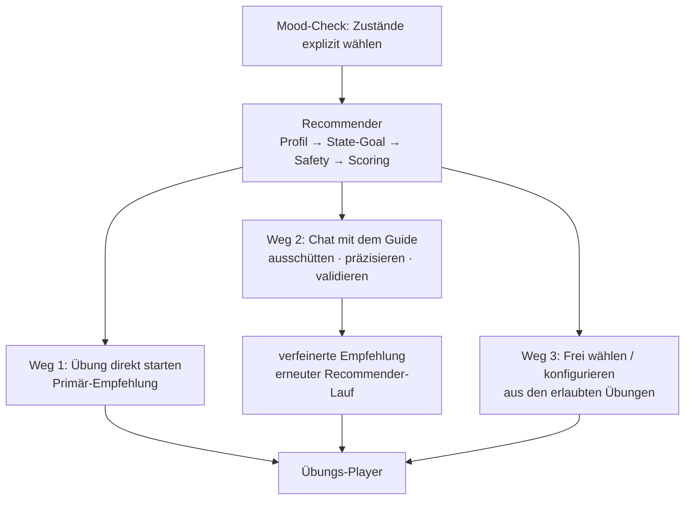

# Chat-Guide – Konzept

> Plan für den LLM-gestützten Guide-Chat in Demonstrator (Web) und Flutter-App.
> Status: Konzept beschlossen, Umsetzung offen. Ergänzt
> [empfehlungssystem.md](empfehlungssystem.md) – der Recommender selbst bleibt
> unverändert regelbasiert.

## Grundprinzip 1: Zustand zuerst – der Chat startet nie den Flow

Der Einstieg ist **immer** die explizite Zustandsauswahl (Mood-Check).
Darauf läuft der Recommender-Algorithmus (`recommendExercises()`), und erst
**danach** öffnen sich drei gleichwertige Wege:



Der Chat **extrahiert keine Zustände aus dem Gespräch als Einstieg**. Er
bekommt Profil, State-Goal und Empfehlungsergebnis als Kontext mitgeliefert
und arbeitet darauf.

## Grundprinzip 2: LLM versteht, Regeln entscheiden

Das LLM wählt niemals selbst eine Übung. Es führt das Gespräch und kann den
Recommender per Tool-Call **erneut** ausführen (mit verfeinerten Eingaben);
Auswahl, Ranking, Begründung und Safety-Filter bleiben vollständig im
deterministischen Regelwerk. Formulieren darf das LLM nur, was im
`RecommendationResult` steht (Reasons, `caution`) – nicht abweichen, nichts
erfinden. Damit bleibt das System erklärbar und die harten Sicherheitsfilter
bleiben hart.

## Rolle des Chats (Weg 2)

1. **Ausschütten:** Der Nutzer darf einfach reden. Der Guide hält das Gespräch
   wertfrei und drängt nicht zur Übung (`kein_vorschlag_noetig`). Der bekannte
   Zustand fließt als Kontext ein („Du hast vorhin ‚gestresst‘ gewählt …“).
2. **Präzisieren:** Erkenntnisse aus dem Gespräch verfeinern die Empfehlung –
   z. B. „ich habe nur 3 Minuten“, „ich liege schon im Bett“, „Atemübungen
   machen mich nervös“, oder eine Stimmung, die der Nutzer beim Check nicht
   angegeben hat. Das LLM ruft dazu `verfeinere_empfehlung` auf; der Server
   führt den Recommender mit den angepassten Eingaben erneut aus.
3. **Validieren:** Fragen zur Empfehlung („Warum das?“, „Was bringt mir das?“)
   beantwortet der Guide aus `ScoreBreakdown`/Reasons und dem
   `EvidenceProfile` – die Erklärung ist dieselbe wie im Demonstrator-Walkthrough.

## Tool-Contract (Server-seitig ausgeführt)

| Tool | Zweck | Ausführung |
|---|---|---|
| `verfeinere_empfehlung(zusatzStimmungen?, entfernteStimmungen?, maxDauerMin?, ausgeschlosseneUebungen?, ausgeschlosseneKategorien?)` | Gespräch hat neue Fakten ergeben | erneuter `recommendExercises()`-Lauf mit angepassten Inputs; Ergebnis (primär + Alternativen + Reasons + caution) geht zurück ans LLM **und** strukturiert an den Client |
| `kein_vorschlag_noetig()` | reines Ausschütten, kein Übungsdruck | markiert den Turn; Client zeigt keine Übungs-Karte |

Wichtig: `zusatzStimmungen` ergänzt die explizit gewählten Zustände, ersetzt
sie nie – Ausgangspunkt bleibt der Mood-Check.

## Kontextblock (vom Client pro Request mitgeschickt, Server stateless)

- Gewählte Stimmungen + berechnetes Profil + State-Goal des aktuellen Checks
- Aktuelles `RecommendationResult` (primär, Alternativen, Reasons, caution)
- `UserSettings`: Langzeitziele, Atem-/Meditationserfahrung, Intensitätspräferenz
- Letzte ~5 Sessions (`SessionFeedback`: Übung, Rating, gestoppt/schlechter gefühlt)
- `recentlyServed` (vermeidet Wiederholungen)
- Tageszeit (`timeOfDay`) + Uhrzeit
- **Profil-Notizen** aus früheren Gesprächen (siehe „Transkripte & Nutzer-Profil“)

## Sicherheit (nicht verhandelbar)

- System-Prompt: kein Therapie-Ersatz, keine Diagnosen, keine Heilversprechen;
  wertfreie, entschleunigte Sprache (Markenstimme).
- **Krisen-Eskalation:** Bei Hinweisen auf Suizidalität/akute Krise verlässt
  der Guide die Übungslogik und verweist auf professionelle Hilfe
  (Telefonseelsorge 0800 111 0 111) – als Prompt-Regel **und** serverseitige
  Prüfung.
- Die Safety-Filter des Recommenders (Kontraindikationen, Atemtechnik-Gates,
  Depth-Gates) sind durch den Chat nicht umgehbar, da jede Empfehlung durch
  `recommendExercises()` läuft.

## Transkripte & Nutzer-Profil (beschlossen)

Transkripte werden gespeichert, um den Nutzer über Sessions hinweg besser zu
begleiten. Zwei Ebenen, weil rohe Transkripte zu lang für den Prompt sind:

1. **Rohe Transkripte** → Supabase (`chat_transcripts`), pro Nutzer/Gerät.
   Dienen Audit, Eval und Prompt-Iteration; werden *nicht* direkt in Prompts
   injiziert.
2. **Destillierte Profil-Notizen** → nach jedem Gespräch extrahiert das LLM
   wenige, dauerhafte Erkenntnisse als strukturierte Notizen (Supabase,
   `user_profile_notes`), z. B. „Atemübungen machen ihn nervös“,
   „wiederkehrendes Thema: Arbeitsstress“, „reagiert gut auf
   Körperwahrnehmung“. Nur diese Notizen (~10–20 Zeilen) gehen in den
   Kontextblock künftiger Gespräche – so entsteht „du hattest mal erwähnt,
   dass …“ ohne Prompt-Explosion. Notizen zu Übungs-Vorlieben fließen
   zusätzlich als Ausschlüsse/Präferenzen in `verfeinere_empfehlung` ein.

**Identität:** anonyme Geräte-ID (UUID, lokal erzeugt, wird mitgesendet) –
kein Account nötig. **Löschung:** „Daten löschen“ im Profil muss auch
Transkripte + Notizen serverseitig löschen (sensible Gesundheitsdaten,
DSGVO). Einwilligungshinweis beim ersten Chat.

## Architektur

- **`api/chat.ts`** (Vercel Function, neben login/session/feedback):
  Claude-API-Proxy, Key nur in Vercel-Env (`ANTHROPIC_API_KEY`). Auth wie
  gehabt (Session-Cookie im Web; Token-Variante für die Flutter-App).
- **v1: einfaches JSON** (`{reply, recommendation, ventingOnly, crisis}`) —
  Antworten sind kurz, Haiku ist schnell; SSE-Streaming ist ein späterer
  Ausbau. `recommendation` ist strukturiert (exercise-id, reasons, caution,
  alternatives), damit Clients die Übung als native Karte rendern.
- Der Server berechnet die Basis-Empfehlung selbst aus den mitgeschickten
  Inputs (`selectedMoodIds`, `timeOfDay`, `userSettings`, `history`,
  `recentlyServed`) — Client und Chat können nicht auseinanderlaufen.
- Modell: `claude-haiku-4-5` (Kurzgespräche, Tool-Use, geringe Latenz/Kosten);
  Upgrade auf Sonnet nur bei Bedarf. Prompt-Caching: stabiler System-Prompt
  mit Cache-Breakpoint, volatiler Kontextblock danach.

### Beispiel-Request (lokal: `vercel dev`)

```bash
curl -s localhost:3000/api/chat \
  -H 'content-type: application/json' \
  -H 'cookie: iz_auth=<SESSION_SECRET>' \
  -d '{
    "deviceId": "dev-test",
    "messages": [{"role": "user", "content": "Ich habe nur 3 Minuten und Atemübungen machen mich nervös."}],
    "context": {
      "selectedMoodIds": ["stressed", "tired"],
      "timeOfDay": "evening",
      "userSettings": {"longTermGoals": ["calm"], "breathworkExperience": "none", "meditationExperience": "some", "practiceIntensity": "balanced"}
    }
  }'
```

## Schutz des API-Keys & Missbrauchsschutz (umgesetzt)

Der Anthropic-Key existiert **nur** als Vercel-Env-Var (`ANTHROPIC_API_KEY`) —
er erreicht nie Browser oder App. Angriffsfläche ist damit der Endpoint
selbst; der ist mehrschichtig gehärtet:

1. **Auth Pflicht:** ohne gültige Session (Passwort-Gate, HttpOnly-Cookie)
   bzw. ohne App-Token → 401, kein Modellaufruf. App-Clients nutzen
   `Authorization: Bearer <APP_API_TOKEN>` — eigenes Token, getrennt vom
   `SESSION_SECRET`, unabhängig rotierbar.
2. **Input-Caps:** max. 2000 Zeichen pro Nachricht (400), Historie
   serverseitig auf 30 Turns gekappt, Stimmungen auf die 9 gültigen IDs und
   max. 3 gefiltert, Notizen/History begrenzt. `max_tokens` 1024.
3. **Rate-Limits** (gezählt über `chat_transcripts`, keine Extra-Infra):
   pro Gerät `CHAT_DEVICE_LIMIT_PER_HOUR` (Default 30/h), global
   `CHAT_GLOBAL_LIMIT_PER_DAY` (Default 400/Tag) als **harter Kosten-Deckel**,
   selbst wenn jemand Geräte-IDs rotiert. Antwort: 429 mit freundlichem Text.
4. **Krisen-Check vor dem Modell** — deterministische Antwort, kein Token-Verbrauch.
5. **Empfohlen zusätzlich (außerhalb des Codes):** Spend-Limit im
   Anthropic-Console-Workspace setzen (zweite, harte Kostengrenze) und
   Vercel Bot-Protection/Firewall aktivieren.

Bekannte Restrisiken (Prototyp-Niveau, bewusst akzeptiert): ein aus der App
extrahiertes `APP_API_TOKEN` erlaubt Requests bis zu den Limits → Rotation
genügt; Geräte-ID ist selbst deklariert → der globale Tagesdeckel ist die
eigentliche Grenze.

## Einbau Web-Demonstrator

Nach dem Empfehlungsergebnis drei Aktionen: **Übung starten** ·
**Mit dem Guide besprechen** (Chat-Panel) · **Frei wählen/konfigurieren**.
Verfeinert der Chat die Empfehlung, aktualisieren sich `RecommendationResult`
und CalculationWalkthrough sichtbar – man sieht also live, *was* das Gespräch
an den Eingaben geändert hat und wie die Regeln neu rechnen. DebugPanel zeigt
zusätzlich Tool-Calls und Prompt-Kontext.

## Einbau Flutter-App

- Der bestehende Ablauf passt bereits: Mood-Check → (künftig: Recommender) →
  Decision-Screen mit genau den drei Wegen (Gespräch / direkt / konfigurieren).
- ConversationScreen (geführter Ablauf) und Companion-Tab rufen denselben
  `api/chat`-Endpoint; Kontext aus SharedPreferences + Gerätezeit.
- Empfohlene Übung erscheint als tappbare Karte → startet den Player mit
  Voice-Over. Heutige Keyword-Logik bleibt Offline-Fallback.

## Schritt 0 (Voraussetzung): Vokabulare angleichen

Flutter und Recommender müssen dasselbe Vokabular sprechen:

- Mood-IDs: Flutter `energetic` vs. Recommender `energized` (+ Flutter kennt
  `overwhelmed`, Recommender nicht) → auf das Recommender-Set normieren.
- Flutter-Intentionen (calm/focus/gratitude/sleep/anxiety/clarity) →
  `LongTermGoal`-Set des Recommenders mappen bzw. ersetzen.
- Gemeinsames Vokabular wird Teil von `scripts/exportFlutter.ts`.

## Evaluation

- Eval-Script mit ~20 synthetischen Gesprächen (Ausschütten, Präzisieren,
  Validieren, Krisenfall) und erwartetem Verhalten (Tool ja/nein, welche
  Anpassungen, Eskalation) – läuft gegen den echten Prompt.
- Feedback-Felder existieren bereits (`SessionFeedback`); optional Transkripte
  mit Einwilligung in Supabase für Prompt-Iteration.

## Phasenplan

| Phase | Inhalt | Aufwand | Status |
|---|---|---|---|
| 0 | Vokabulare angleichen (beide Repos, Export-Skript) | klein | ✅ umgesetzt |
| 1 | `api/chat.ts` + Prompt + Tools + Safety + Transkript-Speicherung | Kern | ✅ umgesetzt (Profil-Notizen-Extraktion noch offen) |
| 1b | Missbrauchsschutz: Bearer-Auth, Caps, Rate-Limits, Tagesbudget | klein | ✅ umgesetzt |
| 2 | Web-Demonstrator: Chat-Weg nach der Empfehlung | mittel | ✅ umgesetzt (Walkthrough-Sync + DebugPanel-Erweiterung offen) |
| 3 | Flutter: ConversationScreen an den Endpoint | mittel | ✅ umgesetzt |
| 4 | Eval-Suite (`scripts/chatEval.ts`) | klein | ✅ umgesetzt |

**Companion-Tab (Flutter): entfernt.** Der Screen war ein Überbleibsel aus
dem React-Mockup (freier Chat als Tab, §2.13 der Migrations-Spec), in Flutter
aber nie erreichbar (keine Navigation dorthin) — und als zustandsloser Chat
hätte er Grundprinzip 1 („Zustand zuerst“) widersprochen. Entscheidung
2026-07-05: Es gibt nur den Chat nach dem Mood-Check. Der „Garten der Stille“
(Übungsbibliothek, Weg 3: frei wählen) ist stattdessen jetzt vom
Decision-Screen aus erreichbar.

## Entscheidungen

1. ✅ Modell: Claude `claude-haiku-4-5` (Key in Vercel-Env).
2. ✅ Transkripte: werden gespeichert, inkl. destillierter Profil-Notizen
   (siehe oben) für eine bessere Profilierung und präzisere Vorschläge.
3. Offen: Auth der Flutter-App gegen den Endpoint (Default: Token analog
   Passwort-Gate, bis etwas Besseres nötig ist).
