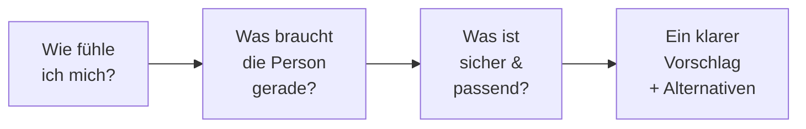
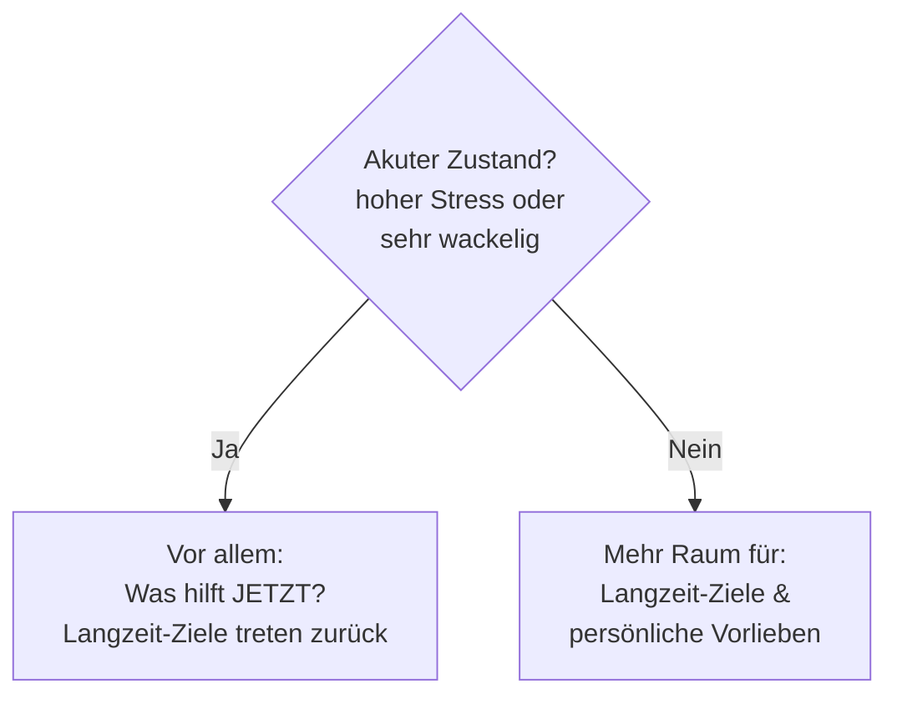

# Wie die Übungsempfehlung entsteht

> Für das Team: eine Erklärung ohne Technik-Jargon. Es geht darum, *warum* die
> App in einer bestimmten Stimmung eine bestimmte Übung vorschlägt.

Die App rät nicht und „lernt" auch nicht heimlich im Hintergrund. Sie folgt
**klaren, nachvollziehbaren Regeln** – so, wie ihr selbst eine Praxis auswählen
würdet: erst schauen, wie es der Person geht, dann das passende Angebot machen,
und dabei immer auf Sicherheit achten.

---

## Der Weg in vier Bildern

### 1. „Wie fühle ich mich?" – das Stimmungsbild

Die Person wählt eine oder mehrere Stimmungen (z. B. *Gestresst*, *Müde*).
Daraus entsteht ein Stimmungsbild entlang von **fünf Empfindungen**:

| Empfindung | Frage dahinter |
|---|---|
| **Grundstimmung** | eher schwer/traurig oder eher hell/froh? |
| **Energie** | erschöpft oder aufgedreht? |
| **Anspannung** | ruhig oder gestresst? |
| **Schwere** | leicht oder bedrückt? |
| **Geerdetheit** | wackelig oder stabil im Boden? |

Werden mehrere Stimmungen gewählt, entsteht ein **Mittelwert** – wie ein
Gesamteindruck, der die einzelnen Gefühle zusammenfasst.

### 2. „Was braucht die Person gerade?" – das Sitzungsziel

Aus dem Stimmungsbild leitet die App **ein** kurzfristiges Ziel ab. Dabei gilt
eine klare Rangfolge: **das Dringlichste zuerst.** Zum Beispiel:

| Wenn vor allem … | … dann ist das Ziel |
|---|---|
| die Person sehr **wackelig/unsicher** wirkt | **Erden & ankommen** |
| **Stress/Anspannung** im Vordergrund steht | **Beruhigen** |
| **Schwere und Traurigkeit** zusammenkommen | **Emotional begleiten** |
| die Person **müde, aber nicht gestresst** ist | **Sanft aktivieren** |
| jemand **energiegeladen** ist | **Fokussieren** |
| die Stimmung **hell und entspannt** ist | **Positives vertiefen** |
| es **Abend** ist | **Zur Ruhe kommen** |

> Das entspricht eurem fachlichen Blick: Eine sehr aufgewühlte Person braucht
> zuerst Boden unter den Füßen – nicht eine aktivierende Atemübung.

### 3. „Was ist sicher & passend?" – zwei Prüfungen

**Zuerst die Sicherheit (harte Grenze).** Manche Übungen werden in bestimmten
Zuständen **grundsätzlich ausgeschlossen** – ganz unabhängig davon, wie gut sie
sonst passen würden. Beispiele:

- Bei **hohem Stress** keine aktivierende Atmung (z. B. *Power Breath*) und keine
  Zielvisualisierung.
- **Schnelle Atemtechniken** entfallen bei Stress, Wackeligkeit, am Abend oder
  für Menschen **ohne Atem-Erfahrung**.
- **Tiefe, herausfordernde Übungen** nur, wenn die Person stabil ist, es
  ausdrücklich möchte und in den Einstellungen freigegeben hat.
  *(Ausnahme: Selbstmitgefühl bleibt bewusst immer zugänglich.)*

Ausgeschlossene Übungen werden mit Begründung angezeigt – also transparent,
nicht versteckt.

**Dann die Passung (Feinauswahl).** Unter den erlaubten Übungen sucht die App
die beste. Vier Dinge sprechen *für* eine Übung, eines *dagegen*:

| Was zählt | Bedeutung |
|---|---|
| 🎯 **Passt zum Ziel** | Dient die Übung genau dem aktuellen Sitzungsziel? *(wichtigster Faktor)* |
| 🌱 **Passt zu Langzeit-Zielen** | Deckt sie sich mit dem, was die Person grundsätzlich üben möchte? |
| 👤 **Persönliche Erfahrung** | Hat *dieser Person* die Übung in ähnlicher Lage schon geholfen? |
| 🔬 **Fachliche Plausibilität** | Wie gut ist die Übung allgemein für diesen Zweck belegt? |
| ⚠️ **Vorsicht/Risiko** | Spricht etwas dagegen? *(zieht Punkte ab)* |

### 4. Der Vorschlag

Die Übung mit der besten Gesamtpassung wird als **Hauptempfehlung** angezeigt,
dazu **zwei Alternativen**. Fertig.

---

## Der entscheidende Gedanke: akut vs. in Ruhe

Die App **gewichtet unterschiedlich**, je nachdem wie es der Person geht:

- **In akuter Belastung** zählt fast nur: *Was bringt jetzt Entlastung und
  Sicherheit?* Persönliche Vorlieben und langfristige Ziele treten in den
  Hintergrund.
- **In ruhigerem Zustand** bekommen die **langfristigen Ziele** und die
  **persönliche Erfahrung** der Person mehr Gewicht.

Das spiegelt gute Praxis: In der Krise stabilisiert man erst – die Entwicklungs-
arbeit kommt, wenn wieder Boden da ist.

---

## Was „persönliche Erfahrung" bedeutet

Wenn jemand Übungen bewertet, merkt sich die App das (**nur lokal auf dem
Gerät**). Ab **drei** Rückmeldungen zur selben Übung in vergleichbarer Lage
fließt diese Erfahrung in die Empfehlung ein – gute Erfahrungen heben die Übung,
schlechte senken sie. Vorher bleibt dieser Faktor neutral, damit einzelne
Ausreißer nichts verzerren.

---

## Zwei Ebenen von Zielen – kurz erklärt

| | **Sitzungsziel** (jetzt) | **Langzeit-Ziele** (grundsätzlich) |
|---|---|---|
| Woher? | aus der aktuellen Stimmung abgeleitet | einmal im Onboarding gewählt |
| Beispiel | „heute erst mal erden" | „insgesamt mehr Gelassenheit" |
| Rolle | **steuert** die Auswahl | **justiert** fein – außer im akuten Zustand |

---

## Drei Sätze für Tür-und-Angel-Gespräche

1. **Die App folgt klaren Regeln** – kein Zufall, keine Blackbox: erst die
   aktuelle Verfassung verstehen, dann sicher und passend empfehlen.
2. **Sicherheit hat immer Vorrang** vor „schön passend": riskante Übungen
   fallen in heiklen Zuständen automatisch raus.
3. **Akut wird stabilisiert, in Ruhe wird entwickelt** – die Gewichtung
   verschiebt sich genau dorthin, wo die Person gerade steht.
