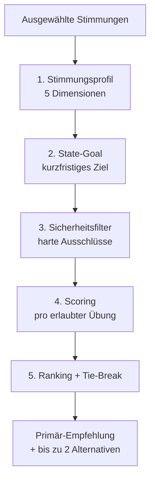

# Empfehlungssystem – Code-Referenz

> Knappe, code-nahe Referenz der Pipeline. Die ausführliche, team-freundliche
> Erklärung mit Diagrammen, Rechenbeispiel und vollständigen Stimmungs-Matrizen
> steht in [algorithmus-visualisierung.md](algorithmus-visualisierung.md).
> **Quelle der Wahrheit ist immer der Code in `src/domain/`** – diese Seite
> fasst nur zusammen.

Das System ist **regelbasiert** (kein ML) und ohne UI testbar
(`src/__tests__/recommender.test.ts`). Pipeline:
`recommendExercises()` in [`src/domain/recommender.ts`](../src/domain/recommender.ts).

---

## Schritt 1 – Stimmungsprofil (5 Dimensionen)

Jede Stimmung ist ein Vektor aus 5 Werten (−2 … +2):
`valence, energy, stress, heaviness, stability`
([`src/data/moods.ts`](../src/data/moods.ts)). Mehrere Stimmungen werden
**dimensionsabhängig** zusammengefasst
([`calculateMoodProfile.ts`](../src/domain/calculateMoodProfile.ts)):

$$
\text{valence} = \varnothing,\quad
\text{energy} = \varnothing,\quad
\text{stress} = \max,\quad
\text{heaviness} = \max,\quad
\text{stability} = \min
$$

Stimmung/Energie werden gemittelt; die **sicherheitsrelevanten** Größen
(Stress, Schwere, Stabilität) nehmen den **Worst Case**, damit ein einzelnes
negatives Signal nicht verwässert wird.

---

## Schritt 2 – State-Goal (Triage)

`explainStateGoal()` in
[`deriveStateGoal.ts`](../src/domain/deriveStateGoal.ts). **Erste zutreffende
Regel gewinnt:**

| # | Bedingung | → State-Goal |
|---|---|---|
| 1 | `stability ≤ −1.5` **und** `stress < 1.2` **und** *nicht* `gestresst` | `grounding` |
| 2 | `gestresst` gewählt **oder** `stress ≥ 1.2` | `stress_reduction` |
| 3 | `heaviness ≥ 1.5` **und** `valence ≤ −1` | `emotional_support` |
| 4 | `energy ≤ −1.2` **und** `stress < 1` | `gentle_activation` |
| 5 | `energiegeladen` gewählt | `focus` |
| 6 | `valence ≥ 1` **und** `stress ≤ 0` **und** `heaviness ≤ 0` | `positive_integration` |
| 7 | Tageszeit `evening` | `evening_regulation` |
| 8 | sonst | `focus` |

> Regel 1 erdet zuerst, **außer** bei akutem Stress – ein „aufgedrehter“ Zustand
> geht direkt in die Beruhigung (Regel 2).

---

## Schritt 3 – Sicherheitsfilter (harte Ausschlüsse)

`safetyRules.ts` – ausgeschlossene Übungen landen in `excludedExercises` und
können **nie** empfohlen werden. Hilfsgrößen: highStress (`stress ≥ 1.2` oder
`gestresst`), lowStability (`stability ≤ −1.5`), breathBeginner
(`breathworkExperience === 'none'`), isEvening. Geprüft werden u. a.:
hoher Stress / müde+gestresst / Schwere+Traurigkeit (Power Breath,
Zielvisualisierung), `rapid_breathing`, `breath_hold`, niedrige Stabilität +
Risiko/Tiefe, Abend, sowie L3-Gating für tiefe Praxis (Ausnahme:
Selbstmitgefühl).

---

## Schritt 4 – Scoring (pro erlaubter Übung)

`calculateFinalScore()` in [`scoring.ts`](../src/domain/scoring.ts). Bausteine:

| Baustein | Bereich | Bedeutung |
|---|---|---|
| `stateFit` | −2, +1, +5 | direkter/benachbarter/kein Zielbezug |
| `profileFit` | −4 … +6 | verkleinert die Übung den gewichteten Abstand zum Ziel-Profil? |
| `mechanismFit` | 0 … +4 | passt das Wirkprinzip (`mechanisms`) zum Ziel? (+2/Treffer) |
| `longTermGoalFit` | 0 … +4 | +2 je Langzeitziel-Treffer |
| `personalEvidence` | −2 … +2 | Bayesianisch geglättete Feedback-Historie (Prior 0, Gewicht 5) |
| `evidenceFit` | 0 … 3 | 5-Facetten-Evidenz-Profil (ersetzt `sciencePrior`) |
| `safetyMultiplier` | 0 … 1 | weiche Dämpfung fordernder Übungen |
| `riskPenalty` | 0 … 3 | `contraindicationRisk` |

**Zwei Modi**, akut $\Leftrightarrow$ `stress ≥ 1.2` ∨ `stability ≤ −1.5`:

$$
\text{Basis}_{akut} = 0{,}9\,\text{stateFit} + 1{,}0\,\text{profileFit} + 0{,}6\,\text{mechanismFit} + 0{,}1\,\text{longTerm} + 0{,}4\,\text{personal} + 0{,}4\,\text{evidence}
$$

$$
\text{Basis}_{ruhig} = 0{,}7\,\text{stateFit} + 0{,}7\,\text{profileFit} + 0{,}5\,\text{mechanismFit} + 0{,}4\,\text{longTerm} + 0{,}5\,\text{personal} + 0{,}4\,\text{evidence}
$$

$$
\text{finalScore} = \text{Basis} \cdot \text{safetyMultiplier} - 0{,}4\,\text{riskPenalty}
$$

> Sicherheit wirkt zweistufig: harter Filter (Schritt 3) + weicher
> `safetyMultiplier` (hier). Persönliche Evidenz überträgt **teilweise** auf
> verwandte Übungen (gleiche Übung 1,0 / Familie 0,5 / Ziel 0,3).

---

## Schritt 5 – Ranking & Tie-Break

Sortierung nach `finalScore` absteigend. Tie-Break:
höherer `evidenceFit` → kürzere Dauer → alphabetisch. **Primär** = höchste Übung,
die primär sein *darf* (`canBePrimary`, Sonderregeln u. a. für Kohärentes Atmen
und Dankbarkeits-Reflexion). **Alternativen** = nächste Übungen mit Score > 0
(max. 2). `RecommendationResult` führt zusätzlich `scoreGap` und
`hasCloseAlternative` (Abstand < 0,3) für die UI.

---

## Übungs-Katalog & Quellen

16 Übungen in [`src/data/exercises.ts`](../src/data/exercises.ts), jede mit
`family`, `mechanisms`, `evidenceProfile` (5 Facetten), `intensity`,
`emotionalDepth`. Die wissenschaftlichen Quellen liegen zentral in
[`src/data/scientificSources.ts`](../src/data/scientificSources.ts) und werden
im **Hintergrund-Tab** der App angezeigt.

> Evidenz ist bewusst als **Plausibilitäts-Leitplanke** gerahmt – keine Aussage
> wie „wissenschaftlich bewiesen“ oder „klinisch validiert“.
