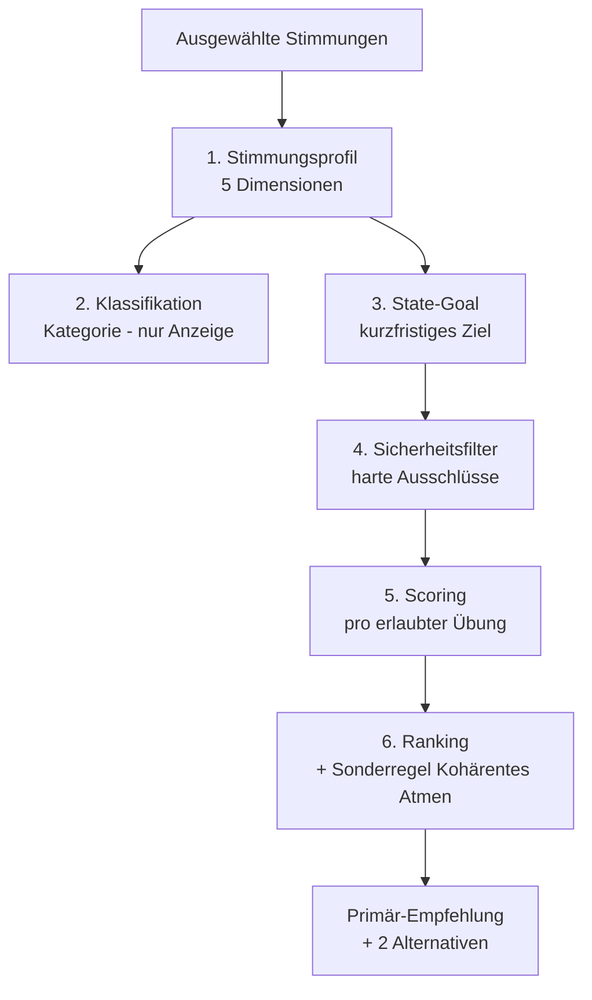

# Empfehlungssystem – Funktionsweise

> Wie aus der Stimmungsauswahl eine Übungsempfehlung wird – Schritt für Schritt,
> mit allen Parametern und Gewichten. Stand: aktueller Code in `src/domain/`.

Das System ist **regelbasiert** (kein ML). Jeder Schritt ist transparent und im
Debug-Panel nachvollziehbar. Die ganze Logik liegt in `src/domain/` und ist
ohne UI testbar.

---

## Überblick: die Pipeline

Eingaben in das System (`RecommenderInput`):

| Eingabe | Quelle | Wirkung |
|---|---|---|
| `selectedMoodIds` | Stimmungsauswahl | Basis des Profils |
| `timeOfDay` | morning / midday / evening | Tageszeit-Regeln |
| `userSettings` | Onboarding/Settings | Langzeitziele, Erfahrung, Freigaben |
| `userIntent` | `auto` / `go_deeper` | Schaltet tiefe Praxis (L3) frei |
| `history` | lokale Feedback-Historie | „Persönliche Evidenz“ im Scoring |

---

## Schritt 1 – Stimmungsprofil (5 Dimensionen)

Jede Stimmung ist ein Vektor aus 5 Werten im Bereich **−2 … +2**. Das Profil der
Session ist der **Durchschnitt** der ausgewählten Stimmungen.

$$\text{Profil}_d = \frac{1}{n}\sum_{i=1}^{n} \text{Stimmung}_{i,d}\quad d \in \{\text{valence, energy, stress, heaviness, stability}\}$$

| Dimension | Bedeutung | − Pol | + Pol |
|---|---|---|---|
| `valence` | Grundstimmung | traurig | freudig |
| `energy` | Energielevel | erschöpft | aufgeladen |
| `stress` | Anspannung | ruhig | gestresst |
| `heaviness` | Schwere | leicht | schwer |
| `stability` | Geerdetheit | instabil | geerdet |

**Stimmungen und ihre Profile** (`src/data/moods.ts`):

| Stimmung | valence | energy | stress | heaviness | stability |
|---|---|---|---|---|---|
| Friedlich | +2 | 0 | −2 | −1 | +2 |
| Froh | +2 | +1 | −1 | −1 | +1 |
| Zufrieden | +2 | 0 | −1 | −1 | +2 |
| Energiegeladen | +1 | +2 | 0 | −1 | 0 |
| Neutral | 0 | 0 | 0 | 0 | 0 |
| Müde | −1 | −2 | 0 | +1 | −1 |
| Schwer | −2 | −1 | +1 | +2 | −2 |
| Traurig | −2 | −1 | 0 | +2 | −1 |
| Gestresst | −2 | +1 | +2 | +1 | −2 |

> Mehrere Stimmungen werden gemittelt, d. h. Gegensätze heben sich teilweise auf.

---

## Schritt 2 – Klassifikation (Kategorie)

Die `Category` (z. B. `acute_regulation`) ist **Legacy** und dient nur noch der
Anzeige/Debugging. Die eigentliche Empfehlung läuft über das **State-Goal**
(Schritt 3). Reihenfolge der Prüfung:

1. `heaviness ≥ 1.5` **und** `valence ≤ −1` → `heaviness_sadness`
2. `stressed` gewählt **oder** `stress ≥ 1.2` **oder** `stability ≤ −1.5` → `acute_regulation`
3. `energy ≤ −1.2` **und** `stress < 1` → `gentle_activation`
4. `valence ≥ 1` **und** `stress ≤ 0` **und** `heaviness ≤ 0` → `positive_integration`
5. sonst → `neutral`

---

## Schritt 3 – State-Goal (kurzfristiges Ziel)

Das **State-Goal** ist das Herzstück: es bestimmt, welche Übungen inhaltlich
passen. **Die Reihenfolge ist entscheidend** – die akuteste/sicherheitsrelevanteste
Regel gewinnt zuerst (`deriveStateGoal.ts`):

| Priorität | Bedingung | → State-Goal |
|---|---|---|
| 1 | `stability ≤ −1.5` | `grounding` |
| 2 | `stressed` gewählt **oder** `stress ≥ 1.2` | `stress_reduction` |
| 3 | `heaviness ≥ 1.5` **und** `valence ≤ −1` | `emotional_support` |
| 4 | `energy ≤ −1.2` **und** `stress < 1` | `gentle_activation` |
| 5 | `energized` gewählt | `focus` |
| 6 | `valence ≥ 1` **und** `stress ≤ 0` **und** `heaviness ≤ 0` | `positive_integration` |
| 7 | Tageszeit = `evening` | `evening_regulation` |
| 8 | sonst | `focus` |

---

## Schritt 4 – Sicherheitsfilter (harte Ausschlüsse)

Vor jedem Scoring läuft ein **harter Filter** (`safetyRules.ts`). Ausgeschlossene
Übungen erscheinen mit Begründung in `excludedExercises` und können **nie**
empfohlen werden. Hilfsgrößen:

- **highStress** = `stress ≥ 1.2` oder `stressed` gewählt
- **lowStability** = `stability ≤ −1.5`
- **breathBeginner** = `breathworkExperience === 'none'`
- **isEvening** = Tageszeit `evening`

| Regel | Bedingung | Ausgeschlossen |
|---|---|---|
| Hoher Stress | highStress | Power Breath, Zielvisualisierung |
| Müde + gestresst | `energy ≤ −1.2` **und** `stress ≥ 1` | Power Breath, Zielvisualisierung |
| Schwere + Traurigkeit | `heaviness ≥ 1.5` **und** `valence ≤ −1` | Power Breath, Zielvisualisierung |
| Rapid Breathing | highStress · lowStability · breathBeginner · isEvening | Übungen mit `rapid_breathing` (Power Breath) |
| Breath Hold | highStress · lowStability · breathBeginner | Übungen mit `breath_hold` (Box Breathing) |
| Niedrige Stabilität | lowStability **und** `depth ≥ 3` (außer Selbstmitgefühl) | tiefe Übungen |
| Niedrige Stabilität | lowStability **und** `risk ≥ 2` | riskante Übungen |
| Abend | isEvening | Power Breath |
| L3-Gating | siehe unten | tiefe Praxis (L3, außer Selbstmitgefühl) |

**L3-Gating** (tiefe Praxis): nur erlaubt, wenn **alle** zutreffen:
`allowDeepPractice` **und** `allowCombinedSessions` **und** `userIntent === 'go_deeper'`
**und** stabiles Profil (`stability > −1` **und** `stress < 1.2` **und** `heaviness < 1.5`).
Ausnahme: **Selbstmitgefühl** ist bewusst ausgenommen, damit emotionale
Verarbeitung auch bei geringer Stabilität verfügbar bleibt.

---

## Schritt 5 – Scoring (pro erlaubter Übung)

Jede erlaubte Übung bekommt einen `finalScore` aus **fünf Komponenten**
(`scoring.ts`). Der `ScoreBreakdown` ist im Debug-Panel sichtbar.

| Komponente | Formel | Bereich | Quelle |
|---|---|---|---|
| **StateFit** | `+5` wenn State-Goal in `stateGoals`, sonst `−2` | −2 … +5 | passt die Übung zum Ziel? |
| **LongTermGoalFit** | `+2` je übereinstimmendem Langzeitziel, **max +4** | 0 … +4 | Onboarding-Ziele |
| **PersonalEvidence** | ab **3** relevanten Einträgen: `Ø-Rating − 3`, sonst `0` | −2 … +2 | lokale Historie |
| **SciencePrior** | fester Wert der Übung | 0 … 3 | Evidenz-Plausibilität |
| **RiskPenalty** | `contraindicationRisk` (wird abgezogen) | 0 … 3 | Kontraindikations-Risiko |

**PersonalEvidence im Detail:** zählt nur Feedback mit **gleicher Übung
*und* gleichem State-Goal**. Unter 3 Einträgen bleibt der Wert neutral (0).
Danach wird das Durchschnitts-Rating (1–5) um 3 zentriert → ca. −2 … +2.

### Gewichtung: zwei Modi

Das System schaltet zwischen zwei Gewichtungen um, je nach Akutheit:

$$\text{akut} = (\text{stress} \ge 1.2)\ \lor\ (\text{stability} \le -1.5)$$

| Komponente | **Akut** (Stress/instabil) | **Normal** |
|---|---|---|
| StateFit | × **0.75** | × **0.5** |
| LongTermGoalFit | × 0.05 | × 0.2 |
| PersonalEvidence | × 0.1 | × 0.2 |
| SciencePrior | × 0.1 | × 0.1 |
| RiskPenalty | **− 1×** (voll) | **− 1×** (voll) |

$$\text{finalScore} = w_1\cdot\text{StateFit} + w_2\cdot\text{LTGFit} + w_3\cdot\text{PersEvidence} + w_4\cdot\text{SciencePrior} - \text{RiskPenalty}$$

> **Kernaussage:** Im akuten Zustand dominiert die unmittelbare Passung
> (StateFit ×0.75); Langzeitziele und persönliche Vorlieben treten zurück.
> Im Normalzustand zählen Langzeitziele und persönliche Evidenz deutlich mehr.

---

## Schritt 6 – Ranking & Sonderregel

1. Alle erlaubten Übungen werden nach `finalScore` **absteigend** sortiert.
2. **Primär** = die höchstbewertete Übung, die primär sein *darf*.
3. **Alternativen** = die nächsten 2 Übungen.

**Sonderregel „Kohärentes Atmen“** (`canBePrimary`): darf in bestimmten Zielen
nur **Alternative**, nie Primär-Empfehlung sein:

- bei `stress_reduction` und `stress ≥ 0.8` → nicht primär
- bei `gentle_activation` oder `emotional_support` → nie primär
- sonst → primär möglich

---

## Durchgerechnetes Beispiel: „Gestresst“

Auswahl: nur **Gestresst** → Profil = `valence −2, energy +1, stress +2, heaviness +1, stability −2`.

1. **State-Goal:** `stability −2 ≤ −1.5` → **`grounding`** (Regel 1 greift zuerst).
2. **Akut?** `stress 2 ≥ 1.2` → **ja**, akute Gewichtung.
3. **Sicherheitsfilter:** highStress + lowStability → **ausgeschlossen:**
   Power Breath, Zielvisualisierung, Box Breathing.
4. **Scoring** der erlaubten Übungen (StateFit ×0.75 + SciencePrior ×0.1 − Risk):

| Übung | StateFit | Science | Risk | finalScore |
|---|---|---|---|---|
| **Physiological Sigh** | +5 (grounding) | 3 | 0 | **4.05** |
| 5-4-3-2-1 | +5 | 2 | 0 | 3.95 |
| 4/6 Atmung | +5 | 2 | 0 | 3.95 |
| Body Scan | +5 | 2 | 1 | 2.95 |
| Kohärentes Atmen | −2 | 2 | 0 | −1.30 |
| Selbstmitgefühl | −2 | 2 | 1 | −2.30 |

→ **Primär: Physiological Sigh**, Alternativen: 5-4-3-2-1 & 4/6 Atmung.

---

## Übungs-Parameter (Referenz)

Auszug der scoring-relevanten Felder aus `src/data/exercises.ts`:

| Übung | Level | State-Goals | SciencePrior | Risk | Atemtechnik |
|---|---|---|---|---|---|
| 5-4-3-2-1 | L1 | grounding, stress_reduction | 2 | 0 | – |
| Physiological Sigh | L1 | stress_reduction, grounding | 3 | 0 | – |
| 4/6 Atmung | L1 | stress_reduction, evening_regulation, grounding | 2 | 0 | – |
| Box Breathing | L2 | focus, stress_reduction | 2 | 1 | breath_hold |
| Kohärentes Atmen | L2 | positive_integration, evening_regulation | 2 | 0 | – |
| Power Breath | L2 | gentle_activation, focus | 1 | 3 | rapid_breathing |
| Body Scan | L2 | emotional_support, evening_regulation, grounding | 2 | 1 | – |
| Selbstmitgefühl | L3 | emotional_support | 2 | 1 | – |
| Zielvisualisierung | L2 | focus, positive_integration | 1 | 1 | – |

---

## Kurz zum Mitnehmen (für die Kommunikation)

- **Zwei Ziel-Ebenen:** *State-Goal* (jetzt, aus der Stimmung) steuert die
  Auswahl; *Langzeitziele* (Onboarding) justieren feiner – außer im akuten Modus.
- **Sicherheit zuerst:** harte Ausschlüsse vor jedem Scoring; bei Stress/instabil
  fallen aktivierende und tiefe Übungen raus.
- **Transparenz:** jeder Score ist aufgeschlüsselt und im Debug-Panel sichtbar.
- **Lernen aus Feedback:** ab 3 Bewertungen fließt persönliche Erfahrung ein –
  im Normalzustand stärker (×0.2) als im akuten (×0.1).
